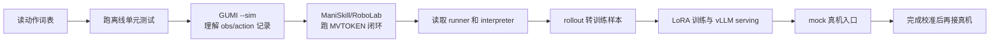
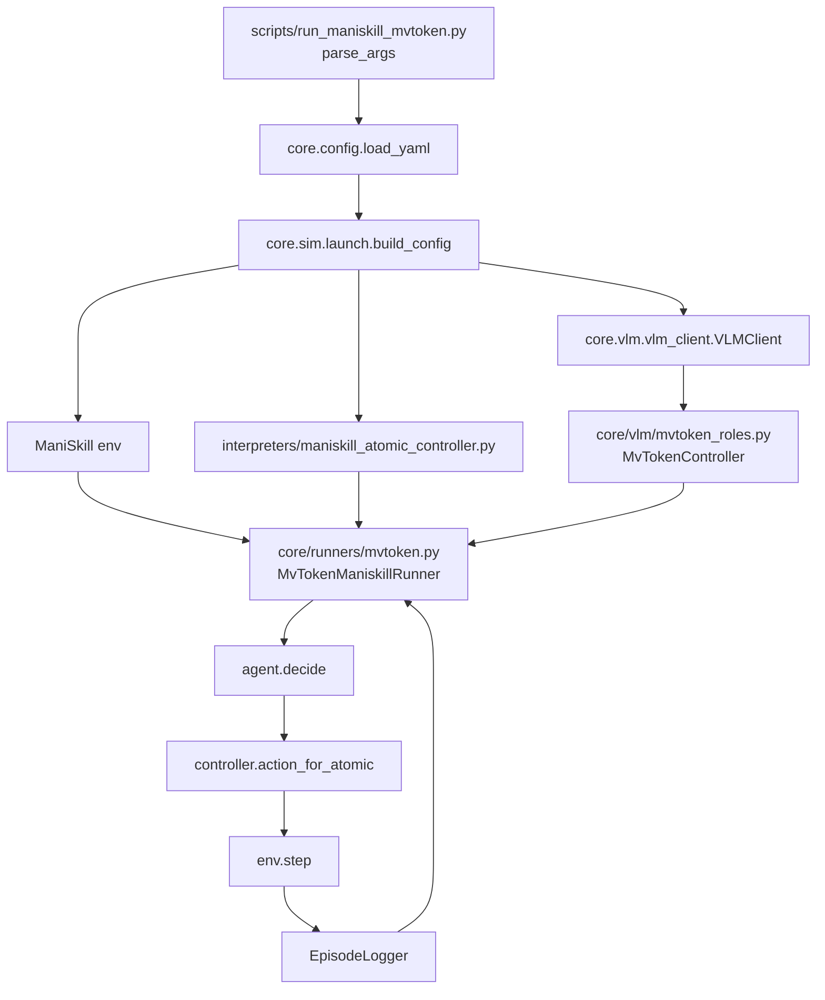

# Show-Harness 新手复现与二次开发教程

这是一份“从不会读，到可以改代码”的实践教程。它和 [OVERVIEW.md](OVERVIEW.md) 的定位不同：

- `OVERVIEW.md` 适合查架构、模块和配置；
- 本文适合按顺序执行，每一步都有“要读的文件、要运行的命令、要改的地方和验收标准”。

## 你最终要达到的能力

阅读完本文后，你应该能够：

1. 说清楚一张相机图像是怎样变成一个 `MV_FWD` 或 `GRASP` 的。
2. 在没有真机的情况下，用模拟器或 mock 路径跑通一次 episode。
3. 找到一个动作的来源、解析位置、执行位置和日志位置。
4. 修改任务、步长、prompt 或插件，并知道修改会影响哪些模块。
5. 把一条 rollout 转成训练样本，理解 LoRA 训练和 serving 的接口。
6. 判断什么时候可以继续改代码，什么时候必须先做硬件校准。

> ⚠️ **安全边界：** 新手学习阶段只使用 `--sim`、`--mock-robot --mock-cameras` 或离线测试。不要因为 mock 跑通就直接连接 Franka/Piper；真机必须先完成 Z floor、begin pose、相机和急停检查。

---

# 第一章：先建立正确的学习路线

## 1.1 先给结论：你不需要一开始读完整个仓库

这个项目文件很多，但复现核心控制链只需要先看下面 12 个文件：

| 顺序 | 文件 | 你要从中学会什么 | 第一次是否修改 |
| --- | --- | --- | --- |
| 1 | `core/action_units.py` | 项目真正的动作词表 | 否 |
| 2 | `core/v0_types.py` | episode、子目标和配置的数据结构 | 否 |
| 3 | `configs/robot_maniskill.yaml` | 一份可运行的模拟器配置 | 先不改 |
| 4 | `configs/primitives_franka.yaml` | token 如何对应方向和步长 | 只在理解后改 |
| 5 | `core/config.py` | YAML 分层和参数优先级 | 否 |
| 6 | `core/vlm/vlm_client.py` | 图像/文本如何发给 VLM，回复如何解析 | 否 |
| 7 | `core/vlm/mvtoken_roles.py` | prompt 如何变成一次 token 决策 | 否 |
| 8 | `interpreters/maniskill_atomic_controller.py` | token 如何变成模拟器 action | 先不改 |
| 9 | `core/runners/mvtoken.py` | 一次 episode 如何循环 | 先不改 |
| 10 | `scripts/run_maniskill_mvtoken.py` | CLI 如何把前面的模块装起来 | 先不改 |
| 11 | `prompts/v3/mvtoken_generator_lite.txt` | 模型实际看到的语言合同 | 可以复制后改，不直接改已发布版本 |
| 12 | `train/data_preparation/rollouts_to_alpaca.py` | rollout 如何变成训练样本 | 先不改 |

暂时不要读这些内容：

- `core/piper/`、`core/franka/`：它们是硬件连接层，理解动作闭环前读会被 ROS/ZeroRPC 细节淹没。
- `core/runners/dual.py`、`dual_mvtoken.py`：双臂比单臂多一层时序和输出协议。
- `plugins/` 下所有目录：先理解主循环，再按一个插件一个插件地读。
- `train/llamafactory_extensions/`：只有训练 Gemma4 或启用 camera dropout 时才需要深入。
- `scripts/trajectory/real2sim/`：先把已有 simulator policy 跑通，再研究数据生成器。

### 重要原则

**第一次不要修改 Python 核心代码。** 先通过修改配置中的 `task`、`max_steps`、`plugins`，或者复制一个 prompt 版本来获得反馈。这样你能区分“理解错误”和“代码改坏了”。

## 1.2 这个项目的一句话心智模型

把项目想成下面这条流水线：

```text
相机/仿真观测
    ↓
图像预处理 + 任务文字 + 最近动作
    ↓
VLM 决策：MV_FWD / MV_DOWN / GRASP / DONE ...
    ↓
动作解释器：把 token 转成末端位移、夹爪命令或仿真 action
    ↓
机器人/模拟器执行
    ↓
记录 obs_t、action_t、结果，进入下一步
```

项目最核心的设计不是某个模型，而是中间的 **动作 token 合同**：模型不直接控制关节，所有本体都通过同一组离散语义动作对接。

## 1.3 两条复现路线

建议按照以下顺序复现：



两种“复现”要区分：

- **代码复现**：理解并跑通一条 episode，重点是动作、相机、配置和日志。
- **论文结果复现**：需要匹配 checkpoint、数据集、prompt version、模拟器版本、GPU 和硬件校准。仓库没有锁定全部外部版本矩阵，精确数字复现属于后续工作，不能把第一次运行目标定成论文表格。

## 1.4 本章检查清单

- [ ] 知道第一次只需要读哪 12 个文件。
- [ ] 能解释“模型输出 token，解释器负责物理落地”。
- [ ] 已决定先走模拟器/mock 路线，而不是直接接真机。
- [ ] 知道代码复现和论文结果复现不是一件事。

---

# 第二章：第一次运行前的环境准备

## 2.1 只安装运行环境

在项目根目录执行：

```bash
# 查看当前环境状态
bash scripts/setup.sh

# 基础环境：读取配置、跑 mock/GUMI、调用已启动的 VLM
bash scripts/setup.sh base
```

基础环境对应 `requirements/requirements.txt`，包含 numpy、OpenCV、Pillow、PyYAML、requests、SciPy、imageio 和 zerorpc。Python 要求为 `>=3.10`，源码注释使用 Python 3.11 作为参考。

如果你当前只是读代码和跑纯 Python 测试，先不用安装真机 overlay、vLLM 或训练环境。

只有在对应阶段才安装：

```bash
# 真机阶段才需要；包含 RealSense、ROS shim 和 pygame
bash scripts/setup.sh base --real

# 本地 GPU VLM 阶段才需要；创建 .venv-vllm
bash scripts/setup.sh serve

# 训练阶段才需要；创建 LLaMA-Factory 环境
bash train/scripts/setup_llamafactory.sh
```

> 💡 **新手建议：** 如果 `base` 安装已经完成，先跳过 `serve` 和 `train`。前两章的主要目标是读懂动作和 runner，不是马上训练模型。

## 2.2 检查 Python 能否导入核心模块

```bash
.venv/bin/python - <<'PY'
from core.action_units import MOVE_ATOMS, GRASP_ATOM, RELEASE_ATOM, DONE_ATOM
from core.v0_types import EpisodeResult, V0Config

print("moves:", MOVE_ATOMS)
print("gripper:", GRASP_ATOM, RELEASE_ATOM)
print("terminal:", DONE_ATOM)
print("default config:", V0Config())
PY
```

你应该看到 6 个移动 token、两个夹爪 token 和 `DONE`。如果这里失败，不要继续研究 runner，先修复虚拟环境或当前工作目录。

## 2.3 运行离线测试

当前仓库的测试使用标准库 `unittest` 组织；项目环境未在 base requirements 中强制安装 pytest：

```bash
.venv/bin/python -m unittest discover -s tests -v
```

测试与学习目标的对应关系：

| 测试 | 新手应该观察什么 |
| --- | --- |
| `tests/test_config_overlays.py` | defaults/body/overlay 和 secret 优先级 |
| `tests/test_execution_token_swap.py` | Piper token swap 只发生在执行边界 |
| `tests/test_replay_rollout.py` | rollout 文件格式、token 校验、回放步长 |
| `tests/test_real_runner_planning.py` | planner 收到哪些视图、计划怎样被记录 |
| `tests/test_subgoal_planner_retry.py` | JSON 失败怎样 retry，子目标怎样合并 |
| `tests/test_gumi_operator.py` | GUMI 的低置信度、重复动作和 dual 安全门 |
| `tests/test_check_setup.py` | 预检怎样识别缺配置和 placeholder floor |

如果测试因为本地缺少某个可选硬件包而失败，先记录失败模块；不要为了一个 Piper/Franka 测试马上安装整套 ROS。先运行不依赖该硬件的测试：

```bash
.venv/bin/python -m unittest \
  tests.test_config_overlays \
  tests.test_execution_token_swap \
  tests.test_replay_rollout \
  tests.test_subgoal_planner_retry
```

## 2.4 本阶段不要做的事

- 不要编辑 `configs/secrets.env` 后把它提交到 Git。
- 不要把 `configs/site/*.example` 当作真实硬件配置直接运行。
- 不要一开始修改 `core/action_units.py`；它是全项目的接口中心。
- 不要用未校准的 `z_floor` 连接真机。
- 不要同时打开几十个终端和服务；先让一个测试或一个模拟器 episode 稳定运行。

## 2.5 本章检查清单

- [ ] `.venv/bin/python` 可以导入 `core.action_units`。
- [ ] 至少通过配置、token swap、replay 相关的离线测试。
- [ ] 知道 base、real、serve、train 四种环境什么时候才需要。
- [ ] 没有把 secret、真实硬件配置或模型权重加入 Git。

---

# 第三章：按文件顺序读懂单臂 MVTOKEN

这是最适合新手的代码阅读主线。每读一个文件，都回答四个问题：

1. 输入是什么？
2. 输出是什么？
3. 状态保存在哪里？
4. 如果我修改它，会影响谁？

## 3.1 第一个文件：`core/action_units.py`

先打开文件：

```bash
sed -n '1,180p' core/action_units.py
```

你会看到：

```python
MOVE_ATOMS = (
    "MV_FWD", "MV_BACK", "MV_LEFT",
    "MV_RIGHT", "MV_UP", "MV_DOWN",
)
GRASP_ATOM = "GRASP"
RELEASE_ATOM = "RELEASE"
DONE_ATOM = "DONE"
STILL_ATOM = "STILL"
```

先画出这个表：

| token | 默认意义 | 具体走多远由谁决定 |
| --- | --- | --- |
| `MV_FWD` 等 6 个 `MV_*` | 增量平移 | `configs/primitives_*.yaml` 的向量和 `step_m` |
| `GRASP` | 闭合夹爪 | 本体 controller 和 gripper threshold |
| `RELEASE` | 打开夹爪 | 本体 controller |
| `DONE` | 结束任务 | runner |
| `STILL` | 双臂中一侧保持不动 | dual runner |

关键理解：`core/action_units.py` **只定义语义名称，不定义 Franka 的 X/Y/Z 数值**。如果你看到有人在 prompt 里直接写 `[1, 0, 0]`，那通常是把两层职责混在了一起。

### 练习

不修改代码，执行：

```bash
.venv/bin/python - <<'PY'
from core.action_units import ATOMIC_ACTIONS, MOVE_ATOMS, ROTATE_ATOMS

print("ATOMIC_ACTIONS =", ATOMIC_ACTIONS)
print("move count =", len(MOVE_ATOMS))
print("rotate =", ROTATE_ATOMS)
PY
```

验收：你能回答 `ROTATE_CW` 为什么不一定出现在 MVTOKEN 的允许输出中——因为 rotation 是可选插件能力，不是 lite prompt 的默认动作合同。

## 3.2 第二个文件：`core/v0_types.py`

重点看四个对象：

- `EpisodeResult`：一次 rollout 的 success、steps、end reason、run directory、video path。
- `Subgoal`：zero-shot planner 的一个阶段，含 `id/target/affordance/motion/description/completion`。
- `V0Config`：`max_subgoal_steps`、`max_replans`、`video_fps` 等 planner/runner 参数。
- `SkillContext`、`SkillCommand`、`SkillOutcome`：插件或技能阶段之间传递的结构化状态。

先不用深究每个字段的默认值，重点理解：

```text
VLM 原始回复
    ↓ 标准化
Subgoal / SkillCommand / token
    ↓
runner 执行
    ↓
EpisodeResult
```

这里是“数据结构边界”，不是机器人运动边界。运动边界在 `interpreters/`。

## 3.3 第三个文件：`configs/robot_maniskill.yaml`

新手优先读模拟器配置，因为它不需要真实 NUC、CAN、RealSense 或 ROS。按下面顺序看：

```bash
sed -n '1,220p' configs/robot_maniskill.yaml
```

重点找这些字段：

| 字段 | 作用 |
| --- | --- |
| `env_id` | ManiSkill 场景名称 |
| `control_mode` | 当前默认 `pd_ee_delta_pos`，即末端位移控制 |
| `camera_resolution`、`agentview_*`、`wrist_*` | 输入给模型的图像合同 |
| `step_m` | 一次控制步命令的位移量 |
| `sim_steps_per_decision` | 一个 token 分解成多少仿真控制步 |
| `move_vectors` | 6 个 `MV_*` 到 XYZ 的方向映射 |
| `max_steps` | 一个 episode 最多决策次数 |
| `vlm_backend`、`vlm_backends` | 要请求的服务和 model name |
| `log_dir` | rollout 输出目录 |
| `plugins.auto_release` | 是否在空抓时自动打开夹爪 |

注意它也有 `overlays`，但 simulator 配置不需要 Franka/Piper 的 site 文件。先把这一份配置当成“实验参数清单”，不要把它当成 Python 对象。

## 3.4 第四个文件：`configs/primitives_franka.yaml`

```bash
sed -n '1,120p' configs/primitives_franka.yaml
```

你要建立如下对应关系：

```yaml
# 文件：configs/primitives_franka.yaml
step_m: 0.02
atomic_primitives:
  MV_FWD:   [1.0, 0.0, 0.0]
  MV_BACK:  [-1.0, 0.0, 0.0]
  MV_LEFT:  [0.0, -1.0, 0.0]
  MV_RIGHT: [0.0, 1.0, 0.0]
  MV_UP:    [0.0, 0.0, 1.0]
  MV_DOWN:  [0.0, 0.0, -1.0]
```

`MV_FWD` 的语义来自模型 prompt；`[1,0,0]` 只是在这个 embodiment 上的物理实现。Piper 由于安装方向和视角不同，可能交换某些方向，所以不能把 Franka primitives 复制给 Piper。

### 第一次可以修改什么

只在模拟器中，把 `step_m` 从 `0.026` 改小到 `0.013`，然后使用 `--probe-axes` 对比实际位移。你要观察的是“每 token 的动作尺度”，不是马上提升成功率。

### 第一次不要修改什么

不要只改 `MOVE_ATOMS` 的字符串，也不要只改 prompt 里的动作说明。动作名称、解析器、训练标签和 interpreter 必须保持一致，后面会专门说明。

## 3.5 第五个文件：`core/config.py`

```bash
sed -n '1,280p' core/config.py
```

只需要先理解三个函数：

### `load_yaml`

配置合并顺序：

```text
代码默认值
  < defaults 列表
  < 当前 YAML 的 body
  < overlays 列表
  < CLI 参数/环境变量
```

例如：

```yaml
defaults:
  - site/franka.yaml
overlays:
  - {path: experiments/current.yaml, optional: true}

fine_step_m: 0.02
```

`defaults` 是底层公共配置，当前文件 body 会覆盖它；`overlays` 最后覆盖 body，适合当前实验状态。site 文件缺失时，代码会给出复制 `.example` 的提示。

### `load_secrets_env`

它不是完整 dotenv 库，只读取 `KEY=VALUE`、注释和可选 `export`。shell 中已经存在的变量默认优先于文件。

### `resolve_vlm_config`

它根据 `vlm_backend: qwen3_5_2b` 找到：

```text
provider + base_url + model + max_tokens + chat_template_kwargs + api key
```

你只需要记住：改 `vlm_backend` 是选择 profile，改 `--model` 是临时覆盖 model 名称，二者不是一回事。

## 3.6 第六个文件：`core/vlm/vlm_client.py`

这是“模型服务适配层”，不是机器人控制器。先找这些方法：

| 方法 | 新手理解 |
| --- | --- |
| `health_check` | 服务启动前是否能访问 `/v1/models` |
| `complete_action_token` | 请求一个 token，并按白名单解析 |
| `complete_action_token_pair` | 一次得到双臂两个 token |
| `complete_action_token_chain` | 左右臂两次回答，第二次看到第一轮结果 |
| `complete_text` | 需要自由文本的 planner/fallback |
| `complete_json` | 需要结构化 JSON 的 planner |
| `_message_content` | 确定图像顺序和文本内容 |
| `_parse_single_token` | 将模型回复收敛到允许 token |

理解一次单 token 请求：

```text
numpy/PIL 图像
    ↓ image_to_data_url
OpenAI messages.content = [image, wrist image, prompt text]
    ↓ requests POST /chat/completions
模型回复 content 或 reasoning_content
    ↓ 去除 <think>、检查白名单
"MV_FWD"
```

### 练习：只测试 token 解析，不访问网络

可以直接读 `_parse_single_token` 和 `tests/test_execution_token_swap.py`；第一次不要把 `VLMClient` 改成另一个 SDK。项目故意用 OpenAI-compatible HTTP，让 hosted provider 和 vLLM 共用一条路径。

## 3.7 第七个文件：`core/vlm/mvtoken_roles.py`

重点看 `MvTokenController.decide`：

1. 接收 `task`、`agentview_image`、`wrist_image`、`recent_moves`。
2. 用 prompt template 填充 `{task}` 和 `{recent_moves}`。
3. 按 `CAMERA_ORDER = ("agentview", "wrist")` 组织图片。
4. 调用 `client.complete_action_token`。
5. 返回 `VLMResponse`，其中 `token` 是最终动作。

这一层决定“模型回答什么格式”；下一层 interpreter 决定“这个 token 实际怎么动”。不要把两层混在一起。

## 3.8 第八个文件：`interpreters/maniskill_atomic_controller.py`

先看这些方法和属性：

- `per_step_m`：把一次 decision 的 `step_m` 分摊到仿真控制步。
- `action_for_atomic(token)`：把 `MV_*` 转成某一个 control step 的 action。
- `open_gripper()` / `close_gripper()`：修改夹爪命令。
- `hold_action()`：不移动，只维持当前 setpoint/夹爪。
- `with_orientation_hold(...)`：维持末端方向，避免仿真 IK 漂移。

ManiSkill controller 并不直接调用真实机器人 API，它返回一个 action array，runner 再把 action 连续送入环境。真机的同类逻辑在 `interpreters/real_atomic_controller.py`，但真机使用绝对末端 setpoint、夹爪稳定等待和 Z floor。

## 3.9 第九个文件：`core/runners/mvtoken.py`

这是单臂 MVTOKEN 的主循环。建议分三次读：

### 第一次：只读 `__init__`

列出 runner 持有哪些依赖：session、controller、agent、logger、config、max_steps、是否启用 auto release、视图配置。

### 第二次：只读 `run`

画出以下状态变化：

```text
初始化/同步夹爪
    ↓
读取 observation
    ↓
整理 agentview + wrist
    ↓
agent.decide
    ↓
人工 DAGGER 是否抢占
    ↓
controller.step(token)
    ↓
auto_release / 记录 / 最近动作
    ↓
DONE 或 max_steps？否则下一轮
```

### 第三次：读辅助方法

优先顺序：`_images` → `_gripper_state` → `_recent_moves_text` → `_maybe_auto_release` → `_record` → `_decide_interruptible`。

你会发现：MVTOKEN runner 的职责是“循环和协调”，不是实现 VLM，也不是实现机器人运动。

## 3.10 第十个文件：`scripts/run_maniskill_mvtoken.py`

这是入口脚本，阅读时不要被 argparse 的大量参数吓到。按下面四段找：

```text
parse_args
  ↓
load_yaml + build_config
  ↓
make_vlm_client + health_check
  ↓
make_maniskill_task + ManiskillAtomicController
  ↓
MvTokenController + MvTokenManiskillRunner
  ↓
runner.run() + 打印结果
```

入口脚本最重要的工程作用是把 CLI/config 的值传给正确的对象。算法逻辑通常不应该写在这里。

## 3.11 单臂主链路总图



## 3.12 本章检查清单

- [ ] 能从 `MV_FWD` 追到 primitives 中的向量。
- [ ] 能从 prompt template 追到 `MvTokenController.decide`。
- [ ] 能说明 `VLMClient`、runner 和 interpreter 各自不应该负责什么。
- [ ] 已读完单臂 MVTOKEN 的入口、角色、解释器和 runner。

---

# 第四章：第一次无硬件运行

## 4.1 选择运行方式

新手不要一开始追求“模型完成任务”。先分成三层：

| 层次 | 是否需要 VLM | 是否需要硬件 | 目的 |
| --- | --- | --- | --- |
| 单元测试 | 否 | 否 | 验证配置、解析和纯逻辑 |
| GUMI `--sim` | 否（人工按键） | 否 | 理解 action -> environment -> rollout |
| ManiSkill/RoboLab MVTOKEN | 是 | 否 | 理解真正的 VLM 闭环 |
| mock 真机入口 | 是 | 否 | 验证真实入口的配置/session/controller 装配 |
| Franka/Piper 真机 | 是 | 是 | 最后才做 |

## 4.2 先跑 GUMI 模拟示教

GUMI 是最容易观察的入口：你用键盘或网页按钮选择 token，系统保存动作执行前的观测，然后执行动作。

```bash
.venv/bin/python gumi/collect_rollouts_web.py \
  data/beginner_single --sim
```

浏览器访问 `http://localhost:8600/`。先点击页面使它获得键盘焦点；使用页面显示的按键表完成模拟拾取任务。双臂版本以后再学：

```bash
.venv/bin/python gumi/collect_rollouts_web_dual.py \
  data/beginner_dual --sim
```

### 这一步要读的文件

按顺序阅读：

1. `gumi/collect_rollouts_web.py`：命令行、模拟/真实 backend 选择、HTTP server 启动。
2. `gumi/web_teleop/backend.py`：单臂观测、动作执行、record gate。
3. `gumi/web_teleop/sim.py`：模拟桌面、物体和 `SimPiperRobot`。
4. `core/teleop/single.py`：`RolloutRecorder` 和 `RolloutCollector`。
5. `core/record/images.py`：图像保存、manifest、视频。

### 观察输出目录

```bash
find data/beginner_single -maxdepth 3 -type f | sort
```

重点打开：

```text
rollout_000/
├── metadata.json      # task、robot、配置等
├── actions.jsonl      # 每一步 token
├── images/
│   ├── agentview/
│   └── wrist/
└── rollout_*.mp4      # 如果该 collector 生成视频
```

不同 collector 的附加文件可能略有差异，以目录实际内容为准。

### 你要回答的问题

- 记录的是动作前的帧，还是动作后的帧？
- 一个按键对应一个 token，还是直接对应关节命令？
- `metadata.json` 中 task 文本从哪里来？
- 如果动作执行失败，下一步还能不能继续记录？

## 4.3 读懂一行 rollout

```bash
sed -n '1,10p' data/beginner_single/rollout_000/actions.jsonl
sed -n '1,220p' data/beginner_single/rollout_000/metadata.json
```

单臂数据的核心关系是：

```text
第 i 行 action token
    ↔
第 i 步的 agentview/wrist 图片
    ↔
执行前的机器人/夹爪状态
```

这就是训练数据中一个监督样本的来源。不要把它理解成“视频结束后再给每一帧贴标签”；标签是在动作发生前产生的。

## 4.4 跑 ManiSkill MVTOKEN

这一步需要一个能提供 OpenAI-compatible `/v1/chat/completions` 的 VLM。你可以使用 hosted profile，也可以在另一终端启动 vLLM。先列出参数和配置，不要直接修改：

```bash
python scripts/run_maniskill_mvtoken.py --help
sed -n '1,220p' configs/robot_maniskill.yaml
```

如果已有已注册的 simulation adapter：

```bash
python scripts/run_maniskill_mvtoken.py \
  --robot-config configs/robot_maniskill.yaml \
  --version v3 \
  --model qwen3_5_2b_showharness_sim \
  --max-steps 10 \
  --probe-axes
```

参数意义：

- `--version v3`：运行时 prompt 必须和训练时一致。
- `--model`：必须等于 VLM server 暴露的 model name。
- `--max-steps 10`：先用小步数验证链路。
- `--probe-axes`：逐个探测 `MV_*` 的实际 TCP delta，并写入 calibration。

如果你还没有 simulation adapter，不要把原始 base VLM 当成已训练 policy；它可能无法稳定输出合法 token。此时先学习代码、跑 GUMI 和离线 converter，等模型准备好再做闭环评估。

## 4.5 不使用 VLM 也能做的 interpreter 练习

阅读 `interpreters/maniskill_atomic_controller.py` 后，可以用测试或简单 Python 脚本构造 controller，检查：

```text
MV_FWD  -> 正 X/配置中的 forward 向量
MV_DOWN -> 负 Z/配置中的 down 向量
GRASP   -> gripper close command
RELEASE -> gripper open command
```

不要凭肉眼猜方向；配置中的向量、模拟器的 camera contract 和 `--probe-axes` 才是证据。

## 4.6 本章检查清单

- [ ] 已用 GUMI `--sim` 生成至少一个 rollout。
- [ ] 能打开 `actions.jsonl`，把一行 token 对应到一组图片。
- [ ] 能解释 `--probe-axes` 的用途。
- [ ] 能区分“原始 base VLM”与“按 MVTOKEN 合同训练的 adapter”。

---

# 第五章：把一次运行完整追踪一遍

这一章的目标不是继续跑更多命令，而是学会调试。选一个 token，例如 `MV_DOWN`，从输入一路追到结果。

## 5.1 从命令开始

入口为：

```text
scripts/run_maniskill_mvtoken.py
```

先看 `parse_args()`，找出 `--robot-config`、`--version`、`--model`、`--max-steps`、`--probe-axes`。然后看 `main()` 的调用顺序。

你应当画出：

```text
args
  ↓
robot_cfg = load_yaml(args.robot_config)
  ↓
cfg = build_config(args, robot_cfg)
  ↓
client = make_vlm_client(args, cfg)
  ↓
env / controller / agent / logger
  ↓
runner.run()
```

## 5.2 从 runner 找决策点

在 `core/runners/mvtoken.py` 中搜索：

```bash
rg -n "def run|decide\(|controller\.step|log_step|DONE|recent" \
  core/runners/mvtoken.py
```

不要一开始从第一行读到最后一行；先定位这些关键词，再回看上下文。你要确定：

- observation 在哪里更新？
- prompt 所需的图像在哪里取出？
- token 在哪里产生？
- human/DAGGER 在哪里可能覆盖 token？
- token 在哪里交给 controller？
- 终止条件是 `DONE`、success 还是 `max_steps`？

## 5.3 从 controller 找物理动作

模拟器路径搜索：

```bash
rg -n "def action_for_atomic|move_vectors|step_m|gripper|DONE" \
  interpreters/maniskill_atomic_controller.py
```

真机路径搜索：

```bash
rg -n "def step|z_floor|GRASP|RELEASE|MV_DOWN|motion_frame" \
  interpreters/real_atomic_controller.py
```

你应当明确：

```text
token ≠ 机器人最终位置
token → primitive vector × step size → setpoint/action → 机器人控制器
```

## 5.4 从日志反向验证

运行结束后检查：

```bash
find rollouts -maxdepth 6 -type f | sort | tail -80
```

如果使用 MVTOKEN 并传入 `--prompt-log-every 1`，还要检查：

```text
controller_prompts/000000.txt
steps.jsonl
metadata.json
summary.json
calibration.json
```

检查顺序：

1. `metadata.json`：使用了哪个 config、prompt、model、seed？
2. prompt 文件：图像顺序、task、recent moves 是否正确？
3. `steps.jsonl`：token、延迟、step_m、执行结果是否匹配？
4. `calibration.json`：轴方向和实际位移是否合理？
5. `summary.json`：runner 为什么结束？

## 5.5 本章检查清单

- [ ] 能从入口脚本追到 `runner.run()`。
- [ ] 能找到 token 产生行和 token 执行行。
- [ ] 能从一行日志确认实际 prompt、token 和执行结果。
- [ ] 遇到失败时会先查 metadata/prompt/steps，而不是立即改模型。

---

# 第六章：训练复现——从 rollout 到 LoRA

## 6.1 先理解训练链，而不是先改 YAML

训练链是：

```text
GUMI/键盘/real2sim rollout
    ↓
train/data_preparation/rollouts_to_alpaca.py
    ↓
rollouts.json（一个动作步一个样本）
    ↓
register_dataset.py
    ↓
LLaMA-Factory dataset_info.json
    ↓
train/scripts/train.sh + train/configs/*.yaml
    ↓
LoRA adapter
    ↓
scripts/serve_vlm.sh
```

先读这三个文件：

1. `train/data_preparation/rollouts_to_alpaca.py`：输入目录、图片、prompt、输出字段。
2. `train/data_preparation/register_dataset.py`：样本格式怎样映射到 LLaMA-Factory。
3. `train/scripts/train.sh`：怎样选择 family、检查 media、启动上游 trainer。

## 6.2 单条 rollout 转样本

假设 GUMI 生成了：

```text
data/beginner_single/rollout_000/
├── actions.jsonl
├── metadata.json
└── images/...
```

执行：

```bash
mkdir -p train/data/beginner_single

python train/data_preparation/rollouts_to_alpaca.py \
  data/beginner_single/rollout_000 \
  --version v3 \
  --task "Pick up the orange block and place it on the plate" \
  --output train/data/beginner_single/rollouts.json
```

查看生成样本：

```bash
python -m json.tool train/data/beginner_single/rollouts.json | sed -n '1,220p'
```

你应该看到近似以下结构：

```json
{
  "instruction": "<image><image>...rendered prompt...",
  "input": "",
  "output": "MV_FWD",
  "images": [
    "/absolute/path/to/agentview.png",
    "/absolute/path/to/wrist.png"
  ]
}
```

每个动作步都会生成一条样本；episode 最后一帧额外合成 `DONE` 样本。`GRASP`/`RELEASE` 不应该被放进 `recent_moves`，转换器和 runtime 必须保持一致。

## 6.3 注册数据集

训练环境准备好后，把样本注册进上游 LLaMA-Factory：

```bash
python train/data_preparation/register_dataset.py beginner_single \
  --samples train/data/beginner_single/rollouts.json \
  --lf-root third_party/LlamaFactory
```

先用 dry run 检查：

```bash
python train/data_preparation/register_dataset.py beginner_single \
  --samples train/data/beginner_single/rollouts.json \
  --lf-root third_party/LlamaFactory \
  --dry-run
```

注册器会根据第一条样本推断：

- `instruction/input/output/images`：Alpaca multimodal；
- `messages/images`：ShareGPT multimodal；
- `videos`：视频槽位格式。

## 6.4 复制训练模板

```bash
cp train/configs/qwen3_5_2b_lora.yaml \
  train/configs/beginner_qwen.yaml
```

只先修改三个位置：

```yaml
# 文件：train/configs/beginner_qwen.yaml
dataset: beginner_single
output_dir: saves/qwen3.5-2b/robot/beginner_single
run_name: qwen3.5-2b-robot-beginner_single
```

第一次不要同时修改 LoRA rank、learning rate、epoch、template 和 cutoff。保持模板默认值，先确认数据管道能启动。

## 6.5 dry run 和正式训练

```bash
CONFIG=train/configs/beginner_qwen.yaml \
GPU=0 \
DRY_RUN=1 \
bash train/scripts/train.sh
```

确认 dataset、图片路径、family 和命令都正确后，再执行：

```bash
CONFIG=train/configs/beginner_qwen.yaml \
GPU=0 \
WANDB_PROJECT=show-harness-beginner \
bash train/scripts/train.sh
```

训练最重要的参数先只理解这些：

| 参数 | 初学者理解 |
| --- | --- |
| `model_name_or_path` | 从哪个基础 VLM 开始 |
| `finetuning_type: lora` | 只训练 adapter，不更新完整模型 |
| `freeze_vision_tower: true` | 默认冻结视觉 backbone |
| `dataset` | 注册器中的名称 |
| `template` | 训练时的对话模板，不能随意改 |
| `image_max_pixels` | 训练图像尺寸合同 |
| `cutoff_len` | 文本/多模态序列上限 |
| `learning_rate` | LoRA 更新速度 |
| `per_device_train_batch_size` | 每张 GPU 的 batch |
| `gradient_accumulation_steps` | 累积几次再更新参数 |
| `num_train_epochs` | 训练遍数 |

## 6.6 训练后 serving

```bash
MODEL=Qwen/Qwen3.5-2B \
FAMILY=qwen3_5 \
LORA=beginner_qwen=/absolute/path/to/adapter-directory \
bash scripts/serve_vlm.sh
```

`beginner_qwen` 必须等于 runtime `--model beginner_qwen`。`FAMILY=qwen3_5` 会选择 `models/chat_templates/qwen3_5_nothink.jinja`；不能把训练模板和服务模板混用。

## 6.7 训练复现的常见失败

| 现象 | 优先检查 |
| --- | --- |
| 训练找不到图片 | `dataset_info.json`、绝对/相对路径、`MEDIA_DIR` |
| 训练能跑但推理质量很差 | prompt version、图像顺序、chat template |
| 模型输出自然语言而不是 token | `enable_thinking: false`、模板、converter 输出标签 |
| 数据改了但训练像没变化 | `overwrite_cache: true`、不要训练中覆盖 `rollouts.json` |
| 一个任务学会，其他任务不会 | `metadata.json.task_text` 是否保留了多任务指令 |
| InternVL 训练/serving 不一致 | 不使用 `<video>`，保持 image slot 和对应模板 |

## 6.8 本章检查清单

- [ ] 能解释一条 rollout 如何生成一条监督样本。
- [ ] 已检查 `instruction/output/images` 字段，而不是只看文件是否生成。
- [ ] 数据已 dry run 注册，训练 YAML 的 dataset 名称正确。
- [ ] 训练结束后知道 adapter path、serving name 和 `--model` 的对应关系。

---

# 第七章：二次开发时到底先改哪个文件

## 7.1 先判断你要改变哪一层

不要从“我要改这个效果”直接跳到随便一个 Python 文件。先按目标选择层：

| 目标 | 第一个应该改的地方 | 不要先改 |
| --- | --- | --- |
| 换任务文字 | `configs/robot_*.yaml` 的 `task` 或 CLI `--task` | runner |
| 换 VLM/backend/model | `vlm_backend`/`vlm_backends` 或 CLI | `VLMClient` |
| 调整每 token 位移 | simulator 的 `robot_maniskill.yaml` 或 primitives | action_units |
| 调整模型看到的说明 | 复制一个 `prompts/vN/*.txt` | token parser |
| 增加提示上下文 | 新建 `plugins/<name>/` | 在 runner 里硬编码字符串 |
| 改模型输出格式 | `core/vlm/*_roles.py` + prompt + tests | interpreter |
| 改 token 物理执行 | 对应 `interpreters/*_atomic_controller.py` | VLM client |
| 增加日志字段 | `core/record/episode_logger.py` 和对应 runner record 调用 | prompt |
| 接入新硬件 | 新 session + interpreter + config/primitives | 先重写所有 runner |
| 改训练样本结构 | converter + register + train template | 先改 vLLM |

最安全的修改顺序是：

```text
配置 → prompt → 插件 → 单元测试 → runner/controller → 新本体
```

## 7.2 二次开发例子一：修改任务和步长

这是最适合第一次修改的练习。

```yaml
# 文件：configs/robot_maniskill.yaml
task_description: "Pick up the block and place it on the coaster"
step_m: 0.020
max_steps: 40
```

执行：

```bash
python scripts/run_maniskill_mvtoken.py \
  --robot-config configs/robot_maniskill.yaml \
  --task-description "Pick up the block and place it on the coaster" \
  --max-steps 5 \
  --probe-axes
```

观察 `calibration.json` 和 `metadata.json`，确认 CLI 覆盖了 YAML，而不是悄悄被其他 overlay 覆盖。

## 7.3 二次开发例子二：新增一个 prompt 片段插件

项目插件的核心要求是：关闭时不改变主循环。参考 `plugins/mem_text/plugin.py` 和 `plugins/variable_step/plugin.py`。

```python
# 文件：plugins/pause_hint/plugin.py
from __future__ import annotations


class PauseHintPlugin:
    def __init__(self, enabled: bool = False, threshold: int = 3) -> None:
        self.enabled = bool(enabled)
        self.threshold = max(1, int(threshold))

    def render_prompt(self, steps_since_grasp: int) -> str:
        # disabled 必须返回空字符串，而不是一条“插件关闭”提示。
        if not self.enabled:
            return ""
        if int(steps_since_grasp) < self.threshold:
            return ""
        return "Inspect the wrist view before issuing another move."
```

接入顺序：

1. 创建 `plugins/pause_hint/__init__.py`，导出 `PauseHintPlugin`。
2. 在一个 robot config 中增加 `plugins.pause_hint: false`。
3. 在 `core/launch.py` 或目标 runner 中构造实例。
4. 在 prompt 组装处加入 `render_prompt(...)`。
5. 写 enabled/disabled 测试，重点验证 disabled 的 prompt 与原 prompt 完全一致。
6. 用 mock/sim 跑 5 步，再决定是否在 zero-shot 中打开。

不要让插件直接 import 一个具体 VLM 类；遵循 `complete_json`、`complete_text`、`complete_token` 的 duck-typed 接口。

## 7.4 二次开发例子三：新增一个动作 token

例如想添加 `MV_ROTATE_LEFT`，这不是只在 `core/action_units.py` 加一行字符串。必须同步：

```text
core/action_units.py
    ↓
prompt 文件和允许输出列表
    ↓
core/vlm/*roles.py 的解析/协议
    ↓
interpreters/*_atomic_controller.py
    ↓
sim controller / replay validator
    ↓
GUMI keyboard/web key map
    ↓
rollout converter 的动作集合
    ↓
训练数据、模型和 serving contract
    ↓
tests
```

所以新手不应该把“新增 token”作为第一个二开任务。先做一个插件或配置扩展，熟悉端到端测试后再做。

## 7.5 二次开发例子四：新增一个本体

建议复制最接近的路径：

- 真实单臂：参考 `core/franka` + `interpreters/franka_atomic_controller.py`。
- ROS 双臂：参考 `core/piper` + `interpreters/piper_atomic_controller.py`。
- 纯模拟：参考 `core/sim` + `interpreters/maniskill_atomic_controller.py`。

最小文件集合：

```text
configs/robot_myarm.yaml
configs/primitives_myarm.yaml
core/myarm/session.py
interpreters/myarm_atomic_controller.py
scripts/run_myarm.py
tests/test_myarm_controller.py
```

先实现 mock session，验证 observation 字段和 token 映射，再接真实 SDK。只要新本体仍然提供同一组语义 token，原有 runner 通常可以复用。

## 7.6 修改后的验证顺序

每次改动都按这个顺序验证：

```bash
# 1. 纯逻辑测试
.venv/bin/python -m unittest discover -s tests -v

# 2. 语法检查
.venv/bin/python -m compileall -q core interpreters plugins gumi scripts train/data_preparation

# 3. mock 或 sim 短运行
#    使用 --max-steps 3~5、--no-show、--mock-* 或 --sim

# 4. 检查 prompt 和日志
#    使用 --prompt-log-every 1，查看 metadata.json / steps.jsonl

# 5. 真机前只读预检
.venv/bin/python scripts/check_setup.py \
  --robot-config configs/robot_franka.yaml
```

真机改动额外要求：

- 先用小 `max_steps`；
- 保留 `enable_z_floor: true`；
- 确认 `empty_width_m` 和 `open_width_m` 是当前夹爪的值；
- 确认急停、操作员视线和 DAGGER 可用；
- 记录本次使用的 config、primitives、prompt version 和 adapter。

## 7.7 本章检查清单

- [ ] 能根据目标判断应该改 config、prompt、plugin、interpreter 还是 runner。
- [ ] 能完成一个 disabled identity 的小插件。
- [ ] 知道新增 token 会影响整条数据/推理/执行链。
- [ ] 新代码先经过离线测试和 mock/sim，再考虑真机。

---

# 第八章：推荐的四周学习计划

## 第 1 周：只读和日志

目标：不改核心代码，能解释 token、配置、日志。

- 第 1 天：`README`、`core/action_units.py`、`core/v0_types.py`。
- 第 2 天：`configs/robot_maniskill.yaml`、两个 primitives 文件。
- 第 3 天：`core/config.py`，运行 `test_config_overlays`。
- 第 4 天：`core/record/images.py`、`episode_logger.py`。
- 第 5 天：GUMI `--sim`，生成并阅读一个 rollout。

## 第 2 周：模型和控制回路

目标：能从图像追到 token，再追到动作。

- 第 1 天：`VLMClient` 的请求/解析。
- 第 2 天：`MvTokenController` 和 v3 prompt。
- 第 3 天：`maniskill_atomic_controller.py`。
- 第 4 天：`core/runners/mvtoken.py`。
- 第 5 天：`run_maniskill_mvtoken.py` 和一次短 episode。

## 第 3 周：数据和训练

目标：能将 rollout 转换、注册、dry run 训练。

- 阅读 `rollouts_to_alpaca.py` 的输入/输出。
- 用一条 GUMI rollout 生成 `rollouts.json`。
- 注册 dataset，检查第一条样本。
- 复制 Qwen config，运行 `DRY_RUN=1`。
- 了解 serving name、adapter path、chat template。

## 第 4 周：二次开发

目标：完成一个小而完整的改动。

建议任务：

1. 增加一个只在 target 不可见时出现的 prompt context 插件。
2. 给 `EpisodeLogger` 增加一个诊断字段，并补测试。
3. 在 simulator 中做一次安全的步长对比实验。

不要把“接入新真机”作为第一个二开项目；它需要硬件 SDK、控制频率、坐标系、校准和安全验证同时正确。

---

# 最终学习验收表

完成以下所有项目，才算真正读懂了这条主线：

- [ ] 不看文档也能说出 `MV_FWD` 的方向不是在 `action_units.py` 定义的。
- [ ] 能指出配置、prompt、VLM client、role、runner、interpreter 和 logger 的边界。
- [ ] 能生成一条 GUMI simulator rollout，并解释 `obs_t -> action_t` 对齐。
- [ ] 能用 `rg` 找到 token 产生和 token 执行的位置。
- [ ] 能用 `--prompt-log-every 1` 检查模型实际收到的输入。
- [ ] 能把 rollout 转成 LLaMA-Factory 样本并 dry run 训练。
- [ ] 能写一个 disabled 时返回空字符串的插件。
- [ ] 知道新增 token 会影响哪些文件，并能列出测试清单。
- [ ] 在任何真机运行前都完成 site 配置、Z floor、begin pose、相机、VLM 和急停检查。

如果只记住一句话：**先读 `action_units → config → VLM role → interpreter → runner → logger`，先用 GUMI/模拟器验证，再做训练，最后才碰真机和新本体。**
