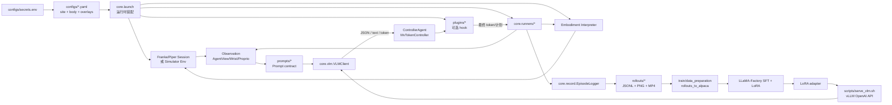
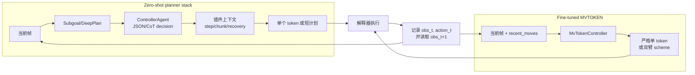
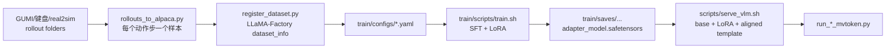

# Show-Harness 技术总览

> 本文基于当前仓库源码、配置与脚本静态分析生成，目标读者是首次接触项目的新成员、算法开发者和机器人平台开发者。
>
> **[需补充]** 仓库没有统一锁定 Franka/Piper ROS、Isaac Sim、ManiSkill、RoboLab 和 CUDA 的完整版本矩阵；本文只记录源码中已经明确的 Python、vLLM、模型与配置约束。

## 文档导航

- [V2.2 当前实验记录](revolution/progress.md)
- [V2.2 总体路线](revolution/route.md)
- [V2.1 Adaptive Capability Harness 计划](revolution/plan02.md)
- [Qwen8B LIBERO 实验进度与换 Session 交接（2026-09-27）](show_harness_qwen8b_progress_2026-09-27.zh-CN.md)
- [新手复现与二次开发教程](BEGINNER_GUIDE.md)
- [第一部分：项目架构分析](#第一部分项目架构分析)
  - [1. 项目整体架构](#1-项目整体架构)
  - [2. 模块详细说明](#2-模块详细说明)
  - [3. 代码组织逻辑](#3-代码组织逻辑)
- [第二部分：快速上手指南](#第二部分快速上手指南)
  - [1. 环境准备](#1-环境准备)
  - [2. 项目启动流程](#2-项目启动流程)
  - [3. 训练参数配置](#3-训练参数配置)
- [第三部分：深入学习路线](#第三部分深入学习路线)
  - [1. 代码阅读顺序](#1-代码阅读顺序)
  - [2. 核心概念理解](#2-核心概念理解)
  - [3. 二次开发指南](#3-二次开发指南)

---

# 第一部分：项目架构分析

## 1. 项目整体架构

### 1.1 项目定位

Show-Harness 是一个将视觉语言模型（VLM）接入机器人控制回路的具身控制框架。它把模型输出限制在一组离散、增量式的语义动作单元中，再由不同本体的解释器将动作确定性地映射到末端位姿、夹爪或仿真动作。

项目有两种主要推理模式：

| 模式 | 入口 | 模型职责 | 控制特点 |
| --- | --- | --- | --- |
| Zero-shot / planner stack | `scripts/run_real.py`、`scripts/run_real_dual.py` | 前沿 VLM 负责规划、阶段推理和动作选择 | 通过子目标、恢复、动作分块等插件增强 |
| Fine-tuned / MVTOKEN | `scripts/run_real_mvtoken.py`、`scripts/run_real_dual_mvtoken.py` | 小型 VLM 每一步输出一个动作 token | 无子目标规划器，固定 prompt contract，适合 LoRA 策略 |

两种模式共享以下边界：

1. 模型面向统一的动作词表，而不是直接产生关节角或任意连续控制量。
2. `configs/primitives_<embodiment>.yaml` 是动作方向、步长和旋转符号的本体级真值。
3. `interpreters/` 负责把 token 解释为 Franka、Piper、ManiSkill 或 RoboLab 的动作。
4. `core/record/` 按观测先于动作的顺序记录数据，使 GUMI 数据采集和在线推理保持同一输入格式。

### 1.2 项目目录树

下面是面向开发者的关键目录树；缓存、虚拟环境、训练产物和运行时 rollout 目录未列出。

```text
Show-Harness/
├── core/                         # 共享运行时与控制循环
│   ├── action_units.py           # VLM 与解释器共享的动作词表
│   ├── config.py                 # YAML 分层、secret、VLM 配置解析
│   ├── launch.py                 # 真机装配：session/controller/plugin/runner
│   ├── v0_types.py               # EpisodeResult、Subgoal、V0Config 等数据类型
│   ├── runners/                  # 单臂、双臂、MVTOKEN、恢复控制循环
│   ├── vlm/                      # OpenAI-compatible 客户端及角色协议
│   ├── record/                   # 图像预处理、JSONL、视频和 episode 日志
│   ├── teleop/                   # 键盘采集与 DAGGER 输入
│   ├── prompting/                # prompt 加载、腕部视图标记
│   ├── franka/                   # Franka ZeroRPC/RealSense session
│   ├── piper/                    # Piper ROS session、相机、运动学
│   ├── sim/                      # ManiSkill/RoboLab 共享模拟器装配
│   └── ui/                       # live view、console 输出
├── interpreters/                 # token -> 物理/仿真动作的本体解释器
│   ├── real_atomic_controller.py
│   ├── franka_atomic_controller.py
│   ├── piper_atomic_controller.py
│   ├── maniskill_atomic_controller.py
│   └── robolab_atomic_controller.py
├── plugins/                     # 按 perceive-reason-act 阶段挂载的插件
│   ├── assembly.py               # 跨 runner 的公共插件构造
│   ├── config.py                 # plugins: 开关解析
│   ├── subgoal/ deepplan/        # 规划与条件任务
│   ├── proprioception/ recovery/ # 状态上下文与失败恢复
│   ├── variable_step/ smooth/    # 步长与轨迹平滑
│   ├── action_chunk/ mem_text/   # 动作分块与动作历史
│   ├── affordance/ view_select/  # 视觉接触点、多视图选择
│   └── dagger/ auto_release/ ... # 人工接管、夹爪反射等
├── gumi/                         # 浏览器示教与 VLM operator
│   ├── collect_rollouts_web.py
│   ├── collect_rollouts_web_dual.py
│   ├── gpt_web_operator.py
│   └── web_teleop*/              # 单臂/双臂 HTTP 服务与模拟后端
├── configs/                      # robot、site、primitives、secret 示例
│   ├── robot_*.yaml              # 按本体 × 推理模式的配置
│   ├── primitives_*.yaml         # token 到向量/步长的映射
│   └── site/*.example            # 需要用户填写的硬件信息
├── prompts/                      # zero-shot 与版本化 MVTOKEN prompt
│   ├── controller*.txt
│   ├── common_context.txt
│   ├── v3/                       # 已发布单臂统一 prompt
│   └── v4/                       # 本体区分与双臂 prompt
├── train/                        # 数据转换、注册、LLaMA-Factory 训练
│   ├── configs/*.yaml
│   ├── data_preparation/
│   ├── scripts/
│   └── llamafactory_extensions/
├── models/                       # chat template 和模型说明
├── scripts/                      # 启动、校准、服务、轨迹和评测脚本
├── tests/                        # 配置、解析、runner、GUMI 和回放测试
├── docs/                         # runbook、模拟器、微调文档
├── requirements/                 # base、real、vLLM 三组依赖
├── pyproject.toml                # Python >= 3.10、ruff、pytest 基础配置
└── README.md / README.zh-CN.md
```

### 1.3 核心模块和职责

| 模块 | 主要职责 | 对外接口/关键文件 | 关键依赖 |
| --- | --- | --- | --- |
| `core.config` | 读取 YAML、合并 defaults/overlays、解析 secret 和 VLM profile | `load_yaml`、`resolve_vlm_config`、`load_secrets_env` | PyYAML、标准库 |
| `core.launch` | 把配置装配成 session、controller、plugins、runner | `build_config`、`make_vlm_client`、`make_session`、`make_controller`、`make_runner` | numpy、各硬件 session |
| `core.action_units` | 维护唯一动作词表 | `MOVE_ATOMS`、`GRASP_ATOM`、`DONE_ATOM` 等 | 无 |
| `core.runners` | 执行 episode 生命周期、决策、动作、恢复与记录 | `RealEpisodeRunner`、`MvTokenRunner`、`DualEpisodeRunner`、`DualMvTokenRunner` | numpy、插件、logger |
| `core.vlm` | 向 hosted/VLM 服务发送图像和文本并解析回复 | `VLMClient`、`ControllerAgent`、`MvTokenController` | requests、OpenAI-compatible HTTP |
| `interpreters` | 将 token 解释为本体动作，实施步长、姿态、夹爪和安全约束 | `RealAtomicController.step`、sim controller 的 `action_for_atomic` | numpy、SciPy、机器人 SDK |
| `core.franka` | 连接 Franka NUC、Cartesian impedance 和 RealSense | `FrankaSession`、`FrankaInterface` | zerorpc、pyrealsense2（real） |
| `core.piper` | 通过 ROS 连接 Piper 双臂及 Orbbec 相机 | `PiperSession`、`DualPiperSession` | ROS Noetic、rospkg、catkin_pkg |
| `core.record` | 保存输入帧、token、reasoning、metadata、校准和视频 | `EpisodeLogger`、`StreamingVideoWriter` | Pillow、imageio、imageio-ffmpeg |
| `plugins` | 在提示组装、决策前后和执行中提供可开关增强 | 每个插件目录的 `plugin.py` | 仅使用 duck-typed VLM 接口 |
| `gumi` | 浏览器键盘/按钮示教和 VLM 操作器 | 8600/8620/8630 三个服务 | Python HTTP、Pillow、硬件后端 |
| `train` | rollout -> Alpaca/ShareGPT -> 注册 -> LoRA | `rollouts_to_alpaca.py`、`train.sh` | LLaMA-Factory、PyTorch、模型 family 环境 |
| `core.sim` | 将同一 MVTOKEN 回路接入 ManiSkill 和 RoboLab | `run_maniskill_mvtoken.py`、`run_robolab_mvtoken.py` | [需补充] 外部模拟器版本 |

### 1.4 模块依赖关系



### 1.5 数据流与两种控制流



**关键时序：**

1. session 读取当前观测；多视图经 `core.record.images` 统一裁剪、旋转、翻转和编码。
2. runner 根据模式构造 prompt；zero-shot 可先调用子目标规划器，MVTOKEN 直接调用 token controller。
3. `VLMClient` 将图片置于文本之前发送到 OpenAI-compatible `/chat/completions`，然后严格解析 JSON、单 token、token pair 或 chain 回复。
4. 插件在决策前后补充上下文、修改协议、抢占或恢复；最终动作交给本体解释器。
5. 解释器把 token 转成绝对末端 setpoint、仿真 action 或夹爪动作，执行后返回结果。
6. logger 保存动作前的观测、模型响应、动作结果及物理校准信息。

> ⚠️ **安全边界：** `z_floor` 是硬约束，`MV_DOWN` 和其他负 Z 命令都不能把目标 setpoint 置于安全地板之下。仓库内的地板、起始位姿和轴符号是参考硬件数值，必须在自己的平台重新校准。

### 1.6 本节检查清单

- [ ] 能说清 zero-shot 与 MVTOKEN 两条 runner 路径。
- [ ] 能指出动作词表、动作映射和本体解释器分别位于哪里。
- [ ] 能解释一帧图像如何变成 token 并被记录为训练样本。
- [ ] 已理解 `z_floor`、夹爪空抓检测和解释器是物理安全边界。

## 2. 模块详细说明

### 2.1 配置加载和优先级

`core/config.py::load_yaml` 支持一个配置文件组合多个层：

```yaml
# 配置文件：configs/robot_franka.yaml
defaults:                         # 先合并；本文件 body 会覆盖它们
  - site/franka.yaml
  - {path: backends/internal.yaml, optional: true}
overlays:                         # 最后合并；overlay 会覆盖 body
  - {path: experiments/current_franka.yaml, optional: true}
```

实际优先级从低到高为：

```text
代码 DEFAULTS < defaults（按顺序） < 当前 YAML body < overlays（按顺序） < CLI/环境变量
```

实现要点：

- 相对路径以声明该层的 YAML 文件所在目录为基准。
- 必需层缺失会报错，并提示从对应 `.example` 复制；`optional: true` 的层缺失会跳过。
- 检测到循环引用会抛出 `config layer cycle`。
- `configs/secrets.env` 和可选的 `configs/secrets.local.env` 只负责注入环境变量；已经 export 的 shell 变量优先级更高。
- `vlm_backend` 选择 `vlm_backends` 中的 profile；`--vlm-backend` 可针对单次运行覆盖。

常用解析接口：

| 函数 | 作用 |
| --- | --- |
| `load_yaml(path)` | 读取并递归合并配置层 |
| `load_secrets_env(path=None)` | 加载 `KEY=VALUE`，不要求安装 python-dotenv |
| `resolve_api_key(vlm_cfg)` | 按 `api_key_env` 解析 hosted provider 的 key |
| `resolve_vlm_config(cfg, backend=None)` | 得到最终 `provider/base_url/model/max_tokens` |
| `camera_contract(cfg)` | 提取相机名称、分辨率、旋转/翻转等跨 runner 合同 |
| `deep_merge(base, override)` | 递归合并 mapping，后者覆盖前者 |

### 2.2 动作词表和解释器接口

`core/action_units.py` 是动作合同的唯一来源：

| 类别 | token | 语义 |
| --- | --- | --- |
| 平移 | `MV_FWD`、`MV_BACK`、`MV_LEFT`、`MV_RIGHT`、`MV_UP`、`MV_DOWN` | 末端沿参考坐标系移动一个离散步长 |
| 旋转（可选） | `ROTATE_CW`、`ROTATE_CCW` | 末端绕 Z 轴旋转；仅在 rotation 插件开启时提供 |
| 夹爪 | `GRASP`、`RELEASE` | 闭合或打开夹爪 |
| 终止 | `DONE` | 结束 episode |
| 双臂/保持 | `STILL` | 当前手臂保持，等待另一手臂 |
| 仿真兼容 | `STOP` | 仿真中保持当前 setpoint；不是默认单臂 VLM 输出 |

真机解释器的核心接口是：

```python
# 文件：interpreters/real_atomic_controller.py
result = controller.step(
    "MV_FWD",
    step_override_m=None,       # 可由 variable_step / replay 覆盖
    motion_frame="base",       # base 或 wrist
)

# result 是 AtomicStepResult，包含：
# token、kind、intended_delta_m、pre_pose、target_pose、post_pose、
# gripper_closed、done、grasp_empty、step_kind、step_m 等字段。
```

解释器依赖的 duck-typed robot 接口为 `get_ee_pose()`、`get_gripper_position()`、`control_gripper(close)` 和 `update_desired_ee_pose(pose7)`。Franka/Piper 子类只处理硬件差异，通用控制器负责：

- 维护命令 setpoint，而不是每次累加噪声较大的测量值。
- 从 `atomic_primitives` 读取单位向量和旋转符号。
- 应用 `step_m`、`yaw_step_rad`、位置/旋转安全上限。
- 可保持 roll/pitch，只增量修改 yaw。
- 在 `GRASP`/`RELEASE` 后等待夹爪稳定并检查空抓。
- 应用 `z_floor_m`，必要时在控制器异常后重新启动底层控制器并重试一次。

`motion_frame` 的含义：

- `base`：直接使用 primitives 中的 base-frame 向量。
- `wrist`：将水平移动向量按当前工具朝向旋转；`MV_UP/MV_DOWN` 仍保持世界竖直。
- `rotation` 插件和 `motion_frame: wrist` 不能重复叠加，代码会拒绝该组合。

### 2.3 VLM 客户端与角色协议

`core/vlm/vlm_client.py::VLMClient` 屏蔽 hosted Gemini/OpenAI 与本地 vLLM 的差异，统一使用 OpenAI-compatible 请求格式。主要接口如下：

| 接口 | 用途 | 回复格式 |
| --- | --- | --- |
| `health_check` | 启动前检查 `/v1/models` | 无业务回复 |
| `complete_text` | planner、描述或 fallback | 文本 |
| `complete_json` | 子目标/双臂结构化决策 | JSON object |
| `complete_action_token` | 单臂 MVTOKEN 或单 token 决策 | 一个允许的 token |
| `complete_action_token_pair` | 双臂 `--once` | `<left> <right>` |
| `complete_action_token_chain` | 双臂 `--chain` | 先左后右，两次回答 |

客户端还提供：

- 失败重试、指数退避和 `Retry-After` 解析。
- `reasoning_content`/`<think>` 清理。
- token 白名单解析和 malformed output 恢复。
- 图像 data URL、图像顺序和响应延迟记录。
- action token 使用 no-thinking chat 参数；服务端 profile 仍必须与训练 prompt 一致。

角色层：

- `core/vlm/roles.py::ControllerAgent`：zero-shot 的 JSON/CoT 动作协议，支持 fallback。
- `core/vlm/mvtoken_roles.py::MvTokenController`：渲染 `{task}`、`{recent_moves}` 并调用单 token 接口。
- `core/vlm/dual_roles.py::DualControllerAgent`：zero-shot 双臂结构化结果，包含每臂 action、reason 和状态。
- `core/vlm/dual_mvtoken_roles.py::DualMvTokenController`：三视图、左/右历史和双臂 scheme。

### 2.4 Runner、session 和日志

| runner | 输入 | 主要用途 |
| --- | --- | --- |
| `RealEpisodeRunner` | 单臂 session + `ControllerAgent` + planner | Franka 或 Piper 单臂 zero-shot |
| `DualEpisodeRunner` | 双臂 session + dual agent | Piper 双臂 zero-shot |
| `MvTokenRunner` | 单臂 session + `MvTokenController` | 真机/部分仿真单臂 MVTOKEN |
| `DualMvTokenRunner` | 双臂 session + dual MVTOKEN controller | Piper 双臂 MVTOKEN |
| `MvTokenManiskillRunner` | ManiSkill env + sim controller | 仿真 MVTOKEN |
| `MvTokenRobolabRunner` | Isaac Lab/RoboLab env + relative IK | RoboLab MVTOKEN |

一个单臂 MVTOKEN episode 的简化逻辑：

```python
# 伪代码，对应 core/runners/mvtoken.py
obs = session.get_observation()
while steps < max_steps:
    images = normalize_views(obs)
    response = agent.decide(task, images, recent_moves)
    token = response.token

    if dagger_has_human_intent():
        token = human_token()
    result = controller.step(token)
    maybe_auto_release(result)
    logger.log_step(obs, response, token, result)

    if result.done or token == "DONE":
        break
    recent_moves = update_history(token)
    obs = session.get_observation()
```

`EpisodeLogger` 通常会写入：

```text
rollouts/.../<run>/
├── metadata.json
├── summary.json
├── calibration.json
├── steps.jsonl              # 紧凑 per-step 记录
├── steps.json               # 含更完整 reasoning 的记录（如启用）
├── controller_prompts/      # --prompt-log-every 开启时
├── images/agentview/
├── images/wrist/
├── rollout_live.mp4
└── rollout_success.mp4 或 rollout_failure.mp4
```

图像记录遵循 `obs_t -> action_t`：动作执行前保存当前帧；这使训练转换器和在线 inference 看到同样的时间对齐关系。

### 2.5 插件接口与调用关系

插件不是动态 registry；runner 明确构造需要的插件，`plugins/assembly.py` 只集中构造跨模式共用的 `dagger`、`video_ref`、`auto_release` 等组件。

三个 hook 面：

1. **构建期 prompt transform**：例如 `coords`、`wrist_frame`、`ego`、`action_ablation` 修改内存中的 prompt，不改源文件。
2. **逐步 prompt/context**：`proprioception`、`mem_text`、`variable_step`、`action_chunk`、`rotation`、`affordance` 提供占位符内容或输出协议。
3. **执行拦截器**：`recovery.before_decision/after_step`、`deepplan` 分支解析、DAGGER 抢占和解释器侧的 smooth/variable-step。

插件必须满足：

- 代码和 prompt 文本放在同一 `plugins/<name>/` 目录。
- 关闭时返回 `""`、`[]`、`None` 或 identity；不能改变无插件路径的行为。
- 通过 `client.complete_json/complete_text/complete_token` duck typing 访问 VLM。
- 超参数由配置传入，不在插件内部隐式读取全局状态。

### 2.6 配置文件与参数说明

#### 机器人配置

| 文件 | 本体/模式 | 入口 | 重要字段 |
| --- | --- | --- | --- |
| `configs/robot_franka.yaml` | Franka zero-shot | `run_real.py` | `task`、`vlm_backend`、`plugins`、`z_floors`、`poses` |
| `configs/robot_franka_ft.yaml` | Franka MVTOKEN | `run_real_mvtoken.py` | `qwen3_5_2b` profile、`auto_release`、prompt/LoRA contract |
| `configs/robot_piper.yaml` | Piper zero-shot | `run_real_dual.py` | `hardware: piper`、双臂任务、`motion_frame` |
| `configs/robot_piper_ft.yaml` | Piper MVTOKEN | 两个 MVTOKEN 入口 | `arms` site layer、token swap、dual profile |
| `configs/robot_maniskill.yaml` | ManiSkill MVTOKEN | `run_maniskill_mvtoken.py` | env、camera、`step_m`、`sim_steps_per_decision` |
| `configs/robot_robolab.yaml` | RoboLab MVTOKEN | `run_robolab_mvtoken.py` | task、renderer、camera contract、IK step |

#### 硬件、动作和 secret 文件

| 文件 | 作用 |
| --- | --- |
| `configs/site/franka.yaml` | NUC IP、RealSense D435/D405 序列号；由 `.example` 复制，必须本地填写 |
| `configs/site/piper_arms.yaml` | 左右臂相机 topic、Z floor、begin/rest joints |
| `configs/primitives_franka.yaml` | Franka 的平移向量、`step_m: 0.02`、`yaw_step_rad: 0.15` |
| `configs/primitives_piper.yaml` | Piper 的轴符号；左右/相对视角可能与 Franka 相反 |
| `configs/secrets.env` | `GEMINI_API_KEY`、`CHATGPT_API_KEY` 等；不要提交到 Git |
| `prompts/v3` | 已发布 MVTOKEN 单臂统一 prompt |
| `prompts/v4` | Franka/Piper 单臂 prompt 和 dual `once/twice/chain` |
| `models/chat_templates` | vLLM 侧复现训练时对话渲染的 Jinja |

> ⚠️ **Prompt 和 chat template 是模型接口的一部分。** 训练时使用的 prompt 版本、图像数量/顺序、历史动作格式和 serving template 必须保持一致；大多数不一致不会触发错误，只会导致策略质量下降。

### 2.7 本节检查清单

- [ ] 能从 `robot_*.yaml` 找到对应入口和硬件层。
- [ ] 能解释 `complete_action_token`、`complete_json` 和 dual `chain` 的区别。
- [ ] 能说明 `AtomicStepResult` 返回的物理结果与 `EpisodeLogger` 的产物。
- [ ] 新插件知道必须实现 disabled identity 行为。

## 3. 代码组织逻辑

### 3.1 命名和文件组织原则

- Python 模块使用小写 snake_case；类使用 PascalCase；动作 token 使用全大写下划线。
- `core/` 只提供通用运行时能力；本体细节进入 `core/franka`、`core/piper`、`interpreters` 或 `core/sim`。
- 配置按“本体 × 模式”命名：`robot_<embodiment>.yaml` 与 `robot_<embodiment>_ft.yaml`。
- 物理动作映射只放在 `primitives_<embodiment>.yaml`，不要在 prompt、runner 中复制向量。
- 入口脚本负责 CLI 和装配，核心决策/执行逻辑放在 `core/`、`plugins/` 和 `interpreters/`。
- prompt 文本版本化放在 `prompts/<version>/`；插件 prompt 文本与插件代码相邻。
- 测试按行为命名，例如配置覆盖、token swap、replay、planner retry、GUMI 安全门。

### 3.2 使用的设计模式

| 模式 | 代码体现 | 解决的问题 |
| --- | --- | --- |
| Layered configuration | `load_yaml` 的 defaults/body/overlays | 分离公共默认、site 身份和实验状态 |
| Adapter / Strategy | `FrankaAtomicController`、`PiperAtomicController`、sim controllers | 统一 token 合同，替换动作落地方式 |
| Template-like runner | 多个 runner 共享 observe-decide-execute-record 生命周期 | 真机、双臂、MVTOKEN 和模拟器复用控制思想 |
| Null Object / inert plugin | plugin disabled 时返回 identity | 支持可复现单插件消融 |
| Duck typing | `VLMClient` 及插件的 client、robot 接口 | 降低模块耦合，便于 mock 测试 |
| Factory / composition root | `core.launch`、`plugins.assembly` | 将配置解析后的依赖集中装配 |
| State machine | `Subgoal` stage、gripper state、DAGGER、recovery | 控制动作阶段和异常转移 |
| Data contract | `actions.jsonl`、图像 manifest、prompt version | 使采集、训练和推理输入形状一致 |

### 3.3 数据流与控制流细节

#### Zero-shot

1. `run_real.py` 解析 CLI，调用 `load_yaml` 和 `build_config`。
2. `make_session` 初始化 Franka/Piper；`make_controller` 读取 primitives 和 safety 参数。
3. 若 `subgoal` 开启，planner 使用 AgentView/Wrist 生成有序 `Subgoal`，并写入 plan/diagnostics。
4. runner 将任务、当前阶段、gripper/proprioception、历史和插件片段组成 controller prompt。
5. `ControllerAgent` 使用 JSON schema 或 CoT 协议得到 token/decision；malformed response 进入 fallback/retry。
6. recovery、deepplan、DAGGER 和 affordance 等执行 hook 可在动作真正发送前后介入。

#### Fine-tuned MVTOKEN

1. converter 将一条 rollout 的每个动作步转换为一个监督样本；图片位于 user turn 顶部。
2. runtime 只传当前两视图、task 和最近最多 5 个 `MV_*` 历史，期望一个 token。
3. Piper 发布 checkpoint 若经过混合本体训练，可能在执行边界交换 `MV_FWD/MV_BACK`；原始 token 仍保留在 prompt history 和日志中。
4. `DONE` 结束 episode；达到 `max_steps` 则以 `max_steps_exceeded` 结束。

#### 双臂

- `--twice`：每步两次 VLM 调用，右臂不看左臂 token，可并行化条件独立性。
- `--once`：一次调用输出左、右两个 token，格式 `<left> <right>`。
- `--chain`：第一次带三视图回答左臂，第二次只发文本 follow-up 回答右臂；右臂能看到左臂回答，图像 prefix 可被 vLLM cache 复用。
- 未动作的手臂使用 `STILL`，训练转换和 runtime 都必须遵守同一 scheme。

### 3.4 本节检查清单

- [ ] 新增动作时知道必须同步词表、prompt、解析器、解释器和测试。
- [ ] 知道 body 配置、site 配置和 overlay 的职责边界。
- [ ] 能画出 zero-shot 与 MVTOKEN 的决策/执行/记录顺序。

---

# 第二部分：快速上手指南

## 1. 环境准备

### 1.1 系统和环境矩阵

| 环境 | 创建方式 | 用途 | 依赖 |
| --- | --- | --- | --- |
| `.venv` | `bash scripts/setup.sh base` | harness、采集、真机、调用已部署 VLM | `requirements/requirements.txt` |
| `.venv` + real overlay | `bash scripts/setup.sh base --real` | Franka/Piper 真机 | base + RealSense、ROS shims、pygame |
| `.venv-vllm` | `bash scripts/setup.sh serve` | 本地 vLLM 服务 | vLLM 0.24.0、Transformers 5.12.1、HF Hub 1.17.0 |
| LLaMA-Factory env | `bash train/scripts/setup_llamafactory.sh` | Qwen3.5/InternVL 训练 | 上游 pinned checkout、PyTorch 等 |
| Gemma4 training env | `... setup_llamafactory.sh --gemma4` | Gemma-4-E4B 训练 | 独立 transformers 环境 |
| RoboLab/Isaac env | [需补充] | Isaac Sim/RoboLab | 外部安装和 EULA |

源码要求 Python `>=3.10`；仓库注释中的参考环境是 Python 3.11、numpy 1.26、OpenCV 4.11。系统级要求：

- Linux；真机需要稳定的 USB/CAN、ROS 或 ZeroRPC 网络连接。
- Base requirements 包含 `numpy>=1.23.5,<2`、`opencv-python>=4.10,<4.12`、`imageio`、`imageio-ffmpeg`、`Pillow`、`PyYAML`、`requests`、`scipy` 和 `zerorpc`。
- Real overlay 额外包含 `pyrealsense2`、`rospkg`、`catkin_pkg`、`pygame`；Piper 的 `rospy` 来自已 source 的 ROS Noetic workspace，不由 pip requirements 提供。
- Serve requirements 固定 `vllm==0.24.0`、`transformers==5.12.1`、`huggingface-hub==1.17.0`，并安装 `prometheus-fastapi-instrumentator>=8.0.1`。
- GPU 推理/训练需要与 vLLM、PyTorch、CUDA 匹配；**[需补充]** 项目没有给出完整 CUDA 驱动版本表。
- Franka 需要 NUC 上运行 Polymetis 兼容的 `franka_server`，工作站需要两个 RealSense。
- Piper 需要 ROS Noetic、AgileX `cobot_magic` workspace、两个 USB-CAN 和三个 Orbbec 相机。
- ManiSkill/RoboLab 需要独立环境；RoboLab 还需要 `ROBOLAB_ROOT`、`OMNI_KIT_ACCEPT_EULA=YES` 和可加载的 `libGLU.so.1`。

### 1.2 安装命令

```bash
# 文件：项目根目录；推荐先查看已有环境
bash scripts/setup.sh

# harness 基础环境
bash scripts/setup.sh base

# 真机附加依赖；该命令内部仍安装 base requirements
bash scripts/setup.sh base --real

# 仅当需要本地部署 VLM 时安装；它会创建 .venv-vllm
bash scripts/setup.sh serve

# 训练环境（与运行时环境独立）
bash train/scripts/setup_llamafactory.sh
# 如训练 Gemma4：
bash train/scripts/setup_llamafactory.sh --gemma4
```

如果没有 `uv`，`base` 安装脚本会回退到 `python3 -m venv` + `pip`；`serve` 目标要求安装 `uv`。

### 1.3 配置本机身份和 secret

```bash
# 文件：项目根目录
cp configs/site/franka.yaml.example configs/site/franka.yaml
cp configs/secrets.env.example configs/secrets.env

# 编辑 configs/site/franka.yaml：
# robot.nuc_ip
# robot.external_camera_serial
# robot.wrist_camera_serial

# 编辑 configs/secrets.env，只放本机 secret：
# GEMINI_API_KEY=...
# CHATGPT_API_KEY=...
```

Piper 使用：

```bash
cp configs/site/piper_arms.yaml.example configs/site/piper_arms.yaml
cp configs/secrets.env.example configs/secrets.env

# 另外在同一个 shell 中加载 ROS workspace
source /opt/ros/noetic/setup.bash
source "${COBOT_MAGIC_DIR:-$HOME/cobot_magic}/Piper_ros_private-ros-noetic/devel/setup.bash"
```

### 1.4 校准和预检

真机第一次运行前必须校准安全地板和起始姿态。Franka 示例：

```bash
# 文件：项目根目录；先让夹爪接触桌面，命令本身不会移动机械臂
bash scripts/franka/capture_z_floor.sh \
  --name default --write --activate

# 手动引导到起始姿态后采集；default 名称保留给 home
bash scripts/franka/capture_pose.sh \
  --name my_task --write --activate

# 只读预检，不会移动机械臂
.venv/bin/python scripts/check_setup.py \
  --robot-config configs/robot_franka.yaml
```

Piper 示例：

```bash
scripts/piper/capture_z_floor.sh --arm left --write \
  --robot-config configs/site/piper_arms.yaml
scripts/piper/capture_z_floor.sh --arm right --write \
  --robot-config configs/site/piper_arms.yaml
scripts/piper/go_begin.py --arm left --capture --write \
  --robot-config configs/site/piper_arms.yaml
.venv/bin/python scripts/check_setup.py \
  --robot-config configs/robot_piper.yaml
```

> ⚠️ **不要直接使用仓库中的参考 `z_floors`、Piper `z_floor_m`、begin joints 或相机序列号。** 预检会把 `0` 或缺失地板标记为失败；如果绕过预检，`MV_DOWN` 可能撞击桌面。

### 1.5 常见问题

| 现象 | 原因 | 处理 |
| --- | --- | --- |
| `requires config layer ... site/...` | 未创建本机 site 文件 | 从对应 `.example` 复制并填写 |
| `z floor ... placeholder` | 地板仍为 0 或未选中 `z_floor_name` | 重新运行 capture 脚本 |
| `VLM endpoint ...` 超时 | vLLM 未启动、模型名不匹配或端口被占用 | 检查 `curl http://localhost:8000/v1/models`，确认 `model` 与 profile 一致 |
| hosted provider 401 | secret 未加载或环境变量名称不对 | 检查 `configs/secrets.env` 的 `api_key_env` |
| Fine-tuned 能输出文本但不输出正确 token | chat template、prompt version 或 family 不匹配 | 使用 `scripts/serve_vlm.sh`，按训练 family 选择 template |
| Piper 无 ROS topic | ROS workspace 未 source 或节点未启动 | 执行 `run_can.sh`、`run_cameras.sh`、`run_arm.sh` 并检查 topic |
| DAGGER 无按键响应 | 使用了 `--no-show`，或没有 live-view stream | 打开 live view；`--no-show` 会禁用该能力 |
| 单 GPU + DeepSpeed 启动失败 | 上游未切到 torchrun | `train.sh` 通常会自动处理；确认 `FORCE_TORCHRUN=1` |
| 训练读取旧图片 | LLaMA-Factory fingerprint 只看路径 | 保持 `overwrite_cache: true`，重建数据前停止训练 |

### 1.6 本节检查清单

- [ ] 已创建正确的 `.venv`/real/serve/training 环境。
- [ ] 已填写 site 配置和 secret，且没有把 secret 提交到 Git。
- [ ] 真机已完成 Z floor 和 begin pose 校准。
- [ ] `scripts/check_setup.py` 通过，或已逐项记录允许的 warning。

## 2. 项目启动流程

### 2.1 启动本地 VLM 服务

Zero-shot 可以使用 hosted `gemini`/`chatgpt` profile；使用本地 VLM 时，服务端独立运行：

```bash
# 终端 1：默认服务 Qwen3.5-2B；Fine-tuned adapter 需按下方命令显式指定 FAMILY/LORA
bash scripts/serve_vlm.sh

# 终端 2：确认服务模型名
curl -s http://127.0.0.1:8000/v1/models
```

Fine-tuned 例子：

```bash
# 终端 1；<adapter-path> 替换为实际含 adapter_model.safetensors 的目录
MODEL=Qwen/Qwen3.5-2B \
FAMILY=qwen3_5 \
LORA=qwen3_5_2b_showharness_ft=<adapter-path> \
bash scripts/serve_vlm.sh
```

环境变量说明：`MODEL` 基础模型；`LORA` 为逗号分隔的 `name=path`；`FAMILY` 为 `qwen3_5|internvl3_5|gemma4`；`PORT` 默认 8000；`GPU` 设置 `CUDA_VISIBLE_DEVICES`；`TP` 是 tensor parallel；`MAX_LEN` 默认 8192；`DRY_RUN=1` 只打印命令。

> ⚠️ 训练不使用 Jinja，但服务必须使用 `models/chat_templates/` 中与 family 对应的模板。不要直接使用基础模型自带 template。

### 2.2 Franka zero-shot

```bash
# 文件：项目根目录；使用 configs/secrets.env 中的 GEMINI_API_KEY
.venv/bin/python scripts/run_real.py \
  --robot-config configs/robot_franka.yaml \
  --task "Pick up the orange block and place it on the plate"
```

本地 hosted profile 切换：

```bash
.venv/bin/python scripts/run_real.py \
  --robot-config configs/robot_franka.yaml \
  --vlm-backend local \
  --max-steps 80
```

无硬件 smoke test（仍需要一个可访问的 VLM endpoint）：

```bash
.venv/bin/python scripts/run_real.py \
  --robot-config configs/robot_franka.yaml \
  --mock-robot --mock-cameras --no-show --max-steps 3 \
  --vlm-backend local
```

### 2.3 Piper zero-shot

启动 Piper 进程：

```bash
# 终端 1：CAN；首次执行可能需要 sudo
scripts/piper/run_can.sh

# 终端 2：三个相机 topic
scripts/piper/run_cameras.sh

# 终端 3：两个 arm node
scripts/piper/run_arm.sh
```

单臂模式：

```bash
scripts/piper/run_rollout.sh \
  --arm left \
  --task "Pick up the banana and place it on the plate"
```

双臂模式 B（一个 VLM 联合决定左右臂）：

```bash
scripts/piper/run_rollout_dual.sh --mode B
```

双臂模式 A（左右臂两个独立 VLM stack）：

```bash
scripts/piper/run_rollout_dual.sh --mode A \
  --task-left "Lift the banana stem" \
  --task-right "Place the banana on the plate"
```

`--mode B` 使用联合双臂输出和 `STILL`；`--mode A` 分别使用 `--task-left/--task-right`。生产真机时先运行 `check_setup.py`，并确保 live view、急停和 DAGGER 按键可用。

### 2.4 Fine-tuned MVTOKEN

单臂 Franka：

```bash
.venv/bin/python scripts/run_real_mvtoken.py \
  --robot-config configs/robot_franka_ft.yaml \
  --vlm-backend finetuned_local \
  --model qwen3_5_2b_showharness_ft \
  --version v3 \
  --task "Pick up the banana and place it on the plate"
```

单臂 Piper 的 v4 prompt（**仅适用于你自己按 v4 训练的 adapter**；已发布 adapter 使用 v3）：

```bash
.venv/bin/python scripts/run_real_mvtoken.py \
  --robot-config configs/robot_piper_ft.yaml \
  --vlm-backend finetuned_local \
  --model my_piper_v4_adapter \
  --version v4 --piper \
  --task "Pick up the tennis ball and place it in the bowl"
```

> ⚠️ 已发布的 `qwen3_5_2b_showharness_ft` 等 real adapter 按 v3 训练，不能只把运行参数改成 v4。v4 示例中的 `my_piper_v4_adapter` 需要先用 `VERSION=v4 EMBODIMENT=piper` 的数据自行训练，并在 vLLM 中以同名 adapter 注册。

双臂 Piper：

```bash
# 三选一，必须与 adapter 的训练 scheme 一致
.venv/bin/python scripts/run_real_dual_mvtoken.py \
  --robot-config configs/robot_piper_ft.yaml \
  --version v4 --once \
  --model my_dual_v4_adapter
```

`my_dual_v4_adapter` 是按 v4 dual scheme 训练并注册到 vLLM 的自定义 adapter；当前已发布的 real adapter 是 v3 单臂合同，不能直接用于该命令。

MVTOKEN 关键参数：

| 参数 | 含义 | 可选值/默认 |
| --- | --- | --- |
| `--version` | `prompts/<version>` 和数据转换 prompt | v3、v4；单臂 MVTOKEN 必须显式传入 |
| `--franka/--piper` | v4 单臂视角合同 | `franka` 或 `piper` |
| `--once/--twice/--chain` | 双臂输出 scheme | 三选一；必须匹配训练 |
| `--model` | vLLM 注册的模型/adapter 名 | profile 的 `model`，可覆盖 |
| `--max-steps` | episode 最大决策步数 | 配置值；必须为正整数 |
| `--step-m` | 覆盖 primitives 的细步长 | 单位 m；应通过校准确定 |
| `--prompt-log-every` | 每 N 步保存 exact prompt | `0` 关闭，默认 20（对应 MVTOKEN entry） |
| `--no-show` | 关闭 live view | 会同时失去 DAGGER |
| `--no-z-floor` | 禁用 Z floor | 仅调试；真机不推荐 |

### 2.5 模拟器启动

ManiSkill：

```bash
python scripts/run_maniskill_mvtoken.py \
  --robot-config configs/robot_maniskill.yaml \
  --version v3 \
  --model qwen3_5_2b_showharness_sim \
  --max-steps 60 \
  --probe-axes
```

RoboLab：

```bash
# 先列出 task；此命令不需要启动 Isaac Sim
python scripts/run_robolab_mvtoken.py --list-tasks

# 只做 view/axis 校准，不执行 policy rollout
python scripts/run_robolab_mvtoken.py \
  --task RubiksCubeTask --dump-views --probe-axes --no-rollout

# headless 多 episode；同一进程复用 Isaac Sim app/env
python scripts/run_robolab_mvtoken.py \
  --version v3 --task RubiksCubeTask --episodes 5
```

ManiSkill 的 `--traj-id` 可用 `0|15|25|40|45|random`；`--layout wide` 重新生成接近训练数据的对象布局。RoboLab 的 `--renderer` 可选 `realtime|pathtracing`，`--gui` 打开 viewport。

### 2.6 GUMI 浏览器示教

单臂模拟：

```bash
.venv/bin/python gumi/collect_rollouts_web.py \
  data/rollouts_demo --sim
# 浏览器打开 http://localhost:8600/
```

双臂模拟：

```bash
.venv/bin/python gumi/collect_rollouts_web_dual.py \
  data/rollouts_dual --sim
# 浏览器打开 http://localhost:8620/
```

VLM operator：

```bash
.venv/bin/python gumi/gpt_web_operator.py \
  --target-url http://localhost:8620 \
  --dry-run
# dashboard 默认 http://localhost:8630/
```

GUMI 端口：单臂 8600，双臂 8620，operator 8630。服务默认绑定 `0.0.0.0` 且没有认证；只在可信网络中使用，公网部署必须额外加反向代理和认证。

### 2.7 多场景启动配置

| 场景 | 配置/命令 | 需要切换的核心合同 |
| --- | --- | --- |
| Franka hosted zero-shot | `run_real.py --robot-config configs/robot_franka.yaml` | hosted API key、Franka site、z floor |
| Franka local zero-shot | 同上加 `--vlm-backend local` | vLLM `/v1` 和 profile model |
| Franka LoRA | `run_real_mvtoken.py --version v3` | base model、adapter name、qwen template |
| Piper zero-shot | `run_real_dual.py --robot-config configs/robot_piper.yaml` | ROS、双臂 topic、各臂 floor |
| Piper LoRA dual | `run_real_dual_mvtoken.py --version v4 --once` | v4 dual scheme、三视图、STILL |
| ManiSkill | `run_maniskill_mvtoken.py --version v3` | sim step calibration、camera transform |
| RoboLab | `run_robolab_mvtoken.py --version v3` | Isaac app 生命周期、IK scale、camera transform |
| GUMI 数据采集 | `collect_rollouts_web.py ... --sim` | 与推理相同的 token 和 obs-before-action |

### 2.8 本节检查清单

- [ ] 能启动一个本地 VLM 或配置一个 hosted profile。
- [ ] 已完成一个 mock/sim smoke test，再尝试真机。
- [ ] MVTOKEN 运行时的 prompt version、family、adapter name 和 chat template 一致。
- [ ] 双臂运行明确选择了 A/B 或 once/twice/chain，并理解 `STILL`。

## 3. 训练参数配置

### 3.1 训练流水线



将自己的 rollout 转成训练集：

```bash
# SRC 是父目录：SRC/<task-name>/rollout_000/...
SRC="$PWD/rollouts/my_env" \
NAME=my_data \
VERSION=v3 \
bash train/scripts/prepare_dataset.sh
```

如果是 Piper v4：

```bash
SRC="$PWD/rollouts/piper" \
NAME=piper_v4 \
VERSION=v4 \
EMBODIMENT=piper \
bash train/scripts/prepare_dataset.sh
```

手动转换和注册：

```bash
python train/data_preparation/rollouts_to_alpaca.py \
  rollouts/my_env/banana/rollout_000 \
  --version v3 \
  --task "Pick up the banana and place it on the plate" \
  --output train/data/my_data/rollouts.json

python train/data_preparation/register_dataset.py my_data \
  --samples train/data/my_data/rollouts.json \
  --lf-root third_party/LlamaFactory
```

转换器支持：

- 单臂 lite：`instruction/input/output/images`，一个动作步一个样本。
- `--use-subgoal`：从 `task_config.json` 注入逐步子目标字段。
- `--use-affordance`：注入目标/接触点 hint。
- `--video-slot`：Qwen 可试验；InternVL 不应使用，保持 image slot。
- 双臂 `--dual --twice|--once|--chain`：分别产生独立 Alpaca、双 token Alpaca 或 ShareGPT chain。
- 末帧自动生成一个 `DONE` 样本。

### 3.2 训练配置参数

以下值来自 `train/configs/*.yaml`，复制模板后可按数据规模和显存调整。

| 参数 | 默认/模板值 | 取值与影响 |
| --- | --- | --- |
| `model_name_or_path` | Qwen 2B / InternVL 2B / Gemma E4B | Hub id 或本地权重；必须与 serving base 一致 |
| `stage` | `sft` | 当前训练为监督微调 |
| `finetuning_type` | `lora` | 不更新完整 backbone |
| `freeze_vision_tower` | `true` | 冻结视觉塔，降低显存和训练成本 |
| `freeze_multi_modal_projector` | `false` | 保留多模态投影层可训练 |
| `lora_rank` | `64` | 越大容量越高、参数和过拟合风险越高 |
| `lora_alpha` | `128` | LoRA 缩放；模板中约为 rank 的 2 倍 |
| `lora_dropout` | `0.05` | 正则化；小数据可适当提高 |
| `lora_target` | `all` | 目标线性层范围；改变后需重新评估容量 |
| `dataset` | `<FILL_ME>` 或 `showharness_sim` | 必须已写入 `dataset_info.json` |
| `template` | `qwen3_5_nothink` / `intern_vl` / `gemma4n` | 训练 family 合同；不能随意替换 |
| `cutoff_len` | `2048` | token 序列上限；过小会截断 prompt/图像上下文 |
| `image_max_pixels` | `65536` | 256×256；应与 rollout 图像尺寸一致 |
| `overwrite_cache` | `true` | 必须保持，避免覆盖图片后命中旧 cache |
| `per_device_train_batch_size` | Qwen 32；其他 4 | 单卡 batch；受显存限制 |
| `gradient_accumulation_steps` | Qwen/InternVL 1/4；sim Qwen 8 | 梯度累积，决定 effective batch |
| `learning_rate` | `1e-4` | LoRA 初始学习率；过大易破坏基础能力 |
| `num_train_epochs` | 30；InternVL 40 | 训练轮数；数据少时重点观察验证和 rollout |
| `lr_scheduler_type` | `cosine` | 学习率衰减策略 |
| `warmup_ratio` | `0.1` | 前 10% step warmup |
| `bf16` | `true` | 需要硬件支持 bfloat16 |
| `logging_steps` | `2` | 日志频率 |
| `save_steps` | `200` | checkpoint 频率 |
| `CAMERA_DROPOUT` | `0`（关闭） | 设为如 `0.15` 随机遮挡视图，但不会同时遮挡所有视图 |
| `GPU` | `0` | `CUDA_VISIBLE_DEVICES`，如 `0,1` |
| `FAMILY` | 从 `template` 推断 | `qwen3_5|internvl3_5|gemma4` |

Effective batch 估算：

```text
effective_batch ≈ GPU 数 × per_device_train_batch_size × gradient_accumulation_steps
```

例如 Qwen 模板推荐在一张卡使用 `32 × 1`；如果改为两张卡，可使用 `16 × 1 × 2` 保持近似相同的 batch/lr 曲线。

常见取值约束：`lora_rank`、`lora_alpha`、batch size、gradient accumulation、`cutoff_len` 和 epoch 应为正数；`lora_dropout` 建议在 `[0, 1)`；`warmup_ratio` 建议在 `[0, 1]`；`learning_rate` 必须大于 0；`CAMERA_DROPOUT` 建议在 `[0, 1)`。扩展实现会保证一次样本至少保留一个相机视图，但过大的 dropout 仍会显著减少有效视觉信息。

### 3.3 常用训练模板

```bash
# 文件：项目根目录；先复制模板
cp train/configs/qwen3_5_2b_lora.yaml train/configs/my_qwen_run.yaml

# 编辑 train/configs/my_qwen_run.yaml：
# dataset: my_data
# output_dir: saves/qwen3.5-2b/robot/my_data
# run_name: qwen3.5-2b-robot-my_data

CONFIG=train/configs/my_qwen_run.yaml \
GPU=0,1 \
WANDB_PROJECT=show-harness \
bash train/scripts/train.sh
```

只检查不训练：

```bash
CONFIG=train/configs/my_qwen_run.yaml \
GPU=0 \
DRY_RUN=1 \
bash train/scripts/train.sh
```

训练完成后服务：

```bash
MODEL=Qwen/Qwen3.5-2B \
FAMILY=qwen3_5 \
LORA=qwen3_5_2b_showharness_ft=train/saves/qwen3.5-2b/robot/my_data/<checkpoint> \
bash scripts/serve_vlm.sh
```

### 3.4 调优建议和最佳实践

1. 先固定 `prompt version`、图像顺序、动作词表和 `chat template`，再调学习率；接口漂移比超参数误差更难定位。
2. 先使用模板的 `lora_rank=64`、`alpha=128`、`lr=1e-4` 和 cosine/warmup，再根据 overfit/欠拟合调整。
3. 混合多任务时保留每个 task 的 `metadata.json.task_text`，不要把所有样本改成同一条语言指令。
4. 重新转换数据前停止训练；转换器会覆盖 `rollouts.json`，可能破坏 LLaMA-Factory fingerprint。
5. 不要混合不同 relative media root；`register_dataset.py` 会尽量将相对图片路径固化为绝对路径。
6. Qwen/Gemma/InternVL 必须使用对应 template；InternVL 保持 image slot，不能照搬 Qwen 的 `<video>` 实验。
7. 用真实闭环 rollout、动作延迟和成功率评估 checkpoint，不只看训练 loss。
8. **[需补充]** 当前仓库没有自动验证集切分、早停策略和每个 task 的建议样本量，需要团队根据实验记录补齐。

### 3.5 本节检查清单

- [ ] rollout 目录包含 `actions.jsonl`、图像和 `metadata.json`。
- [ ] converter 的 `--version`/`--franka`/`--piper` 与 runtime 一致。
- [ ] 数据已注册到正确的 LLaMA-Factory `dataset_info.json`。
- [ ] 训练 family、template、base model 和 serving family 一致。
- [ ] 已跑过 `DRY_RUN=1` 和前 200 条 media 检查。

---

# 第三部分：深入学习路线

## 1. 代码阅读顺序

### 1.1 推荐路径

| 阶段 | 必读文件 | 可选文件 | 学习目标 |
| --- | --- | --- | --- |
| 1. 项目边界 | `README.md`、`README.zh-CN.md`、`docs/finetuned.md` | `docs/franka.md`、`docs/piper.md` | 理解两种模式、动作合同和训练合同 |
| 2. 语义接口 | `core/action_units.py`、`core/v0_types.py` | `core/prompting/wrist_marker.py` | 认清 token、Subgoal、EpisodeResult 数据结构 |
| 3. 配置装配 | `core/config.py`、`core/launch.py` | `configs/README.md` | 掌握分层合并、CLI 覆盖、VLM profile、安全参数 |
| 4. 模型协议 | `core/vlm/vlm_client.py`、`core/vlm/roles.py`、`core/vlm/mvtoken_roles.py` | `dual_roles.py`、`dual_mvtoken_roles.py` | 掌握 HTTP payload、解析、重试和 prompt 渲染 |
| 5. 物理落地 | `interpreters/real_atomic_controller.py` | `franka_atomic_controller.py`、`piper_atomic_controller.py` | 理解 setpoint、坐标系、步长、Z floor、夹爪稳定 |
| 6. 运行循环 | `core/runners/real.py`、`mvtoken.py` | `dual.py`、`dual_mvtoken.py`、`preemption.py` | 跟踪一次 decision 到 log 的全过程 |
| 7. 可插拔增强 | `plugins/README.md`、`plugins/config.py`、`plugins/assembly.py` | `subgoal`、`recovery`、`affordance` | 理解插件阶段和 disabled identity 契约 |
| 8. 数据闭环 | `core/record/episode_logger.py`、`core/teleop/single.py` | `core/teleop/dual.py`、GUMI | 明白 obs/action 对齐与 rollout 格式 |
| 9. 训练闭环 | `train/README.md`、`rollouts_to_alpaca.py`、`register_dataset.py` | `train/llamafactory_extensions` | 从 rollout 追到 LoRA serving |
| 10. 模拟器 | `core/sim/*`、`docs/simulators.md` | `scripts/trajectory/real2sim/*` | 理解跨本体动作尺度和 camera contract |

### 1.2 分阶段练习

**阶段 A：只读配置。** 执行 `python scripts/check_setup.py --robot-config ...`，观察 defaults/body/overlay 如何解析，不连接硬件。

**阶段 B：只读 token。** 阅读 `VLMClient._parse_single_token`、`parse_token_pair` 和 tests 中的 malformed output 测试，理解模型自由文本如何被收敛到白名单。

**阶段 C：mock/sim 闭环。** 使用 GUMI `--sim` 或 runner 的 `--mock-robot --mock-cameras`，查看 `steps.jsonl`、`metadata.json` 和视频。

**阶段 D：插件消融。** 只改 `plugins:` 布尔值，比较 `subgoal/recovery/mem_text/variable_step` 开关前后的 prompt、动作和结果。

**阶段 E：数据复现。** 用一条短 rollout 跑 converter 和 register，再用 `DRY_RUN=1` 检查训练命令，不立即消耗 GPU。

### 1.3 本节检查清单

- [ ] 已按“词表 → 配置 → VLM → 解释器 → runner → 记录 → 训练”顺序阅读。
- [ ] 能在 mock/sim 中生成一条 rollout 并定位其日志文件。
- [ ] 能用测试文件定位一个行为合同，而不是只依赖 README。

## 2. 核心概念理解

### 2.1 Atomic action 与 embodied harness

连续控制被分解成语义原子动作：VLM 只回答“向哪个方向移动一步”“抓取”“释放”或“完成”。这带来三个工程收益：

1. **模型与本体解耦**：相同 token 可被 Franka、Piper、ManiSkill 和 RoboLab 各自解释。
2. **数据可复用**：GUMI 的每一次按键就是一个有明确标签的监督动作。
3. **安全可审计**：步长、轴符号、Z floor 和夹爪阈值由确定性代码控制。

代价是策略必须学习离散的闭环搜索；步长过大、相机合同漂移、动作方向交换都会直接影响成功率。

### 2.2 Prompt contract 和 MVTOKEN

Fine-tuned policy 不是“任意 VLM + 任意 prompt”。它对以下输入分布有硬依赖：

- prompt version；
- 视图数量和顺序（单臂 AgentView/Wrist，双臂 AgentView/WristLeft/WristRight）；
- 图像分辨率、旋转和翻转；
- task 文本和 `recent_moves` 的格式；
- no-thinking chat template；
- 单臂 one-token 或双臂 once/twice/chain 输出形状。

v3 是已发布单臂统一合同；v4 是分本体单臂和双臂合同。Piper 的 egocentric 视角和 Franka 的 exocentric 视角不同，混合训练 checkpoint 通过配置声明 execution-boundary token swap；该 swap 只作用于送入 controller 的 token，不改变 history 和日志。

### 2.3 Zero-shot planner 与 Subgoal

zero-shot 路径先把自然语言任务转成一组包含以下字段的 `Subgoal`：

```json
{
  "id": "grasp",
  "target": "orange block",
  "affordance": "top surface",
  "motion": "GRASP",
  "description": "Close the gripper around the block.",
  "completion": "The block is visibly held."
}
```

`SubgoalPlanner` 会将规划结果标准化；遇到 JSON 失败时保留完整 prompt 做 text retry。`RealEpisodeRunner` 维护当前 stage、stage step budget、replan 次数和 recovery 状态。`deepplan` 可将条件任务延迟到观察到 pivot 后再解析，而不是提前执行所有分支。

### 2.4 视图、坐标和动作尺度

- `AgentView` 用于全局定位、目标与另一只手臂的关系。
- `Wrist` 用于近距离精对齐；`WRIST: YES/NO` 可作为 variable-step/action-chunk 的距离信号。
- `base` frame 使用 primitives 的原始向量。
- `wrist` frame 根据工具当前 heading 旋转水平向量，适合 egocentric 视角。
- 仿真不应假定 commanded step 等于 measured step：ManiSkill 通过 `step_m × sim_steps_per_decision` 校准，RoboLab 还要考虑 relative IK 的实际比例。

当前配置中的参考校准：

| 平台 | 配置事实 | 说明 |
| --- | --- | --- |
| Franka/Piper primitives | `step_m: 0.02` | 约 2 cm 的离散平移量，仍需硬件确认 |
| ManiSkill | `step_m: 0.026`、`sim_steps_per_decision: 2` | 达到约 20.2 mm，存在 PD lag |
| RoboLab | `step_m: 0.072` | relative IK 约实现 28%，实测约 20.1 mm |

### 2.5 失败恢复和安全反射

- `RealAtomicController` 在 `GRASP` settle 后根据 `grasp_min_width_m` 检查是否空抓，并可立即 `RELEASE`。
- `auto_release` 每步检查闭合夹爪宽度，抓取后滑落或闭合空手时重新打开。
- `recovery` 根据接触、下降受阻、gripper 状态等信号提示或回滚当前阶段。
- `z_floor` 限制命令 setpoint；它不依赖模型是否意识到桌面，因此应保留开启。
- GUMI operator 在低置信度、重复/振荡、近距离双臂危险或保存门关闭时暂停，但暂停不能撤回已经发送的动作；急停仍需可触达。

### 2.6 双臂时序和信息条件

双臂不是简单复制单臂：

- `twice` 控制两个独立条件分布，左 token 不传给右臂。
- `once` 让 decoder 在一次回复中自回归产生左、右 token。
- `chain` 将左 token 作为 assistant turn 回填，再以 text-only follow-up 请求右 token；右 token 有左 token 的上下文。

因此训练数据的 message 结构、图像编码次数、左右顺序和推理入口必须完全匹配。

### 2.7 理论基础与参考资料

建议按以下顺序补充理论：

1. VLM/多模态 SFT：理解图像 token、chat template、LoRA、冻结视觉塔。
2. 机器人末端控制：Cartesian impedance、relative differential IK、姿态四元数和 SO(3)。
3. 行为克隆：理解 `obs_t -> action_t` 的监督对齐、闭环误差和 covariate shift。
4. 具身 agent：理解 planner、subgoal、recovery、action chunking 与 affordance grounding。
5. 阅读仓库直接关联资料：[项目 README](../README.md)、[Fine-tuned mode](finetuned.md)、[Simulators](simulators.md)、[Plugins](../plugins/README.md)、[训练 README](../train/README.md)。
6. 项目论文入口见 README 中的 [ArXiv 链接](https://arxiv.org/abs/2609.10522)；论文中各 plugin 的实验映射以代码和配置为准。

> **[需补充]** 本仓库没有在文档中展开 SO(3)、Cartesian impedance、LoRA 或行为克隆的教材级推导；需要面向内部培训时，应增加带实验数据和公式的附录。

### 2.8 本节检查清单

- [ ] 能解释 token 为什么比连续关节命令更适合跨本体数据合同。
- [ ] 能说清 prompt drift、camera drift 和 axis/sign drift 的区别。
- [ ] 能解释空抓恢复、Z floor 和 DAGGER 分别解决哪类风险。
- [ ] 能区分 dual 的 twice、once、chain 信息条件。

## 3. 二次开发指南

### 3.1 扩展点一：新增插件

推荐复制 `plugins/mem_text` 这样的轻量 context provider：

```python
# 文件：plugins/pause_hint/plugin.py（示例，需自行接入 launch）
from __future__ import annotations

class PauseHintPlugin:
    """Disabled 时完全不改变 prompt；enabled 时添加一条可审计提示。"""

    def __init__(self, enabled: bool = False, max_steps: int = 3) -> None:
        self.enabled = bool(enabled)
        self.max_steps = max(1, int(max_steps))

    def render_prompt(self, steps_since_grasp: int) -> str:
        if not self.enabled:
            return ""
        if int(steps_since_grasp) < self.max_steps:
            return ""
        return "After several steps since GRASP, inspect the wrist view before moving."
```

接入步骤：

1. 建立 `plugins/pause_hint/__init__.py` 和可选的 `pause_hint.txt`。
2. 在 `plugins/config.py` 仍使用一个布尔开关，不要引入第二套配置系统。
3. 在 `core/launch.py::make_runner` 或对应 runner 明确构造它。
4. 在 prompt 拼接位置添加 hook；关闭时必须返回 identity。
5. 为 enabled/disabled、文本替换和 runner 行为添加测试。

### 3.2 扩展点二：新增本体或控制后端

新增本体至少需要以下组件：

1. `configs/primitives_<name>.yaml`：为所有必需 `MV_*` 给出向量和步长。
2. `interpreters/<name>_atomic_controller.py`：实现与现有 controller 相同的动作语义。
3. `core/<name>/` session：提供 observation 和硬件连接/断开生命周期。
4. `configs/robot_<name>.yaml`：声明硬件、相机合同、安全参数和 VLM profile。
5. 入口脚本或在已有入口中加入明确的 hardware branch。
6. `tests/`：至少验证 token 映射、夹爪、Z floor、相机顺序和 mock session。

最小验证思路：

```python
# 文件：tests/test_my_embodiment_controller.py（示意）
def test_all_move_tokens_are_mapped(controller):
    for token in ("MV_FWD", "MV_BACK", "MV_LEFT", "MV_RIGHT", "MV_UP", "MV_DOWN"):
        result = controller.step(token)
        assert result.token == token

def test_down_does_not_cross_floor(controller):
    controller.set_z_floor(0.20)
    controller.step("MV_DOWN")
    assert controller.target_pose[2] >= 0.20
```

不要在新 runner 中重新定义 token 方向；统一从 `core.action_units` 和 primitives 配置导入。

### 3.3 扩展点三：新增 prompt/model contract

如果要训练新 prompt 版本：

1. 在 `prompts/vN/` 放入所有对应的单臂/双臂模板。
2. 更新 converter 的版本选择和 runtime 入口参数说明。
3. 用同一模板转换训练数据并记录版本、视图顺序、图像尺寸、历史窗口。
4. 训练后使用 `--prompt-log-every 1` 检查 runtime prompt 与 converter 输出的字段一致。
5. 在 `models/chat_templates/` 或 `scripts/serve_vlm.sh` 中声明正确的 serving template。
6. 更新 `docs/finetuned.md` 和相关测试，避免新成员误用 v3/v4。

### 3.4 扩展点四：新增模拟器

建议复用 `scripts/trajectory/real2sim/` 的 simulator-agnostic 轨迹格式：

- backend 只负责 reset、读取相机、执行 atomic token、输出 success predicate。
- 输出与真机相同的 `actions.jsonl`、图像相对路径和 `metadata.json`。
- 先实现 `--dump-views` 和 `--probe-axes`，确认相机 transform 与每 token 的实际位移。
- 在 policy evaluation 前运行 dataset quality gate；不要把未知/错误相机合同的数据直接送入训练。

### 3.5 二次开发示例

#### 示例 A：实验性大步长策略

只修改配置，不改核心代码：

```yaml
# 文件：configs/robot_franka.yaml 或独立 overlay
plugins:
  variable_step: true

fine_step_m: 0.02
coarse_step_m: 0.04
up_step_m: 0.04
high_above_table_m: 0.08
```

`VariableStepPlugin` 会在 `MV_UP`、末端高于桌面阈值或目标不在 Wrist 视图时选择 coarse step；接近目标后恢复 fine step。建议先在 mock/sim 使用 `--probe-axes` 和短 rollout 验证，不要直接对陌生硬件增大步长。

#### 示例 B：加入一个新 LoRA checkpoint

```bash
# 1. 服务端注册新 adapter；name 必须和 --model 一致
MODEL=Qwen/Qwen3.5-2B FAMILY=qwen3_5 \
LORA=my_qwen_policy=/absolute/path/to/adapter \
bash scripts/serve_vlm.sh

# 2. 使用既有 runtime contract，先用 mock/短 episode 验证
.venv/bin/python scripts/run_real_mvtoken.py \
  --robot-config configs/robot_franka_ft.yaml \
  --vlm-backend finetuned_local \
  --model my_qwen_policy \
  --version v3 --mock-robot --mock-cameras --no-show \
  --max-steps 5 --prompt-log-every 1
```

检查 `controller_prompts/`、token 是否属于白名单、服务 `/v1/models` 是否暴露 `my_qwen_policy`。确认后再连接真机。

#### 示例 C：回放并调试一条已记录轨迹

```bash
# 文件：项目根目录；replay 会优先使用 steps.jsonl，并在连接硬件前校验 token
python scripts/trajectory/replay_rollout.py \
  rollouts/real/MVTOKEN/<date>/<task>/<run> \
  --pause-min-s 0.1 --pause-max-s 0.2
```

回放器会拒绝未知 token、非递增 index 和部分缺失 index；可用 `--force-step-m` 做统一步长实验。真机回放前必须再次确认 primitives、z floor、夹爪和急停状态。

### 3.6 贡献规范、调试与测试

贡献流程：

1. 修改前先运行 `git status --short`，不要覆盖他人未提交的 site/experiment 文件。
2. 小改动保持一个明确主题；配置、prompt、代码和测试一起提交。
3. 新增行为先写离线单元测试，再运行 mock/sim smoke test，最后才接真机。
4. 不提交 `configs/secrets.env`、模型权重、真实相机数据和大体积 rollout；检查 `.gitignore`。
5. 修改 prompt contract 时，必须同步 converter、runtime、模型 serving 文档和 checkpoint 说明。

基础检查：

```bash
# 文件：项目根目录；使用标准库 unittest，不依赖额外 pytest 包
.venv/bin/python -m unittest discover -s tests -v

# 基础语法检查（仓库 requirements 没有强制安装 ruff）
.venv/bin/python -m compileall -q core interpreters plugins gumi scripts train/data_preparation

# 可选：本机已安装 ruff 时，使用 pyproject.toml 中的 F/E9 规则
ruff check .

# 配置和真实环境只读预检
.venv/bin/python scripts/check_setup.py \
  --robot-config configs/robot_franka.yaml
```

调试技巧：

- 使用 `--debug` 查看 runner 和 VLM 诊断；`DEBUG=1` 也可开启默认 debug。
- MVTOKEN 设置 `--prompt-log-every 1`，核对 exact prompt、图像 fingerprint、响应 token 和 latency。
- RoboLab 使用 `--dump-views` 对比 raw/sent 图像；使用 `--probe-axes` 记录实际 TCP delta。
- ManiSkill 同样使用 `--probe-axes` 检查 token 轴符号和步长。
- 使用 `python scripts/trajectory/step_timing.py <rollout-dir-or-parent>` 分析 camera、VLM、动作执行耗时。
- 无硬件时优先 `gumi --sim`、`--mock-robot --mock-cameras` 和回放测试。
- 先看 `metadata.json` 中解析后的 config、prompt 文件、hardware 和 seed，再看 `steps.jsonl`。

### 3.7 本节检查清单

- [ ] 新插件遵守 disabled identity、配置单一来源和 duck-typed client。
- [ ] 新本体补齐 primitives、session、interpreter、config 和测试。
- [ ] 新模型验证了 prompt version、图像合同、chat template 和 adapter name。
- [ ] 已运行 pytest、ruff、mock/sim smoke test 和必要的 axis/view 校准。
- [ ] 真机改动有可回退配置、现场急停和独立校准记录。

---

## 总体交付检查清单

- [ ] 项目结构、核心模块、依赖关系和数据流已能从本文定位到源码。
- [ ] 所有真机命令都提醒了 site 配置、secret 和安全校准。
- [ ] zero-shot、MVTOKEN、双臂、ManiSkill、RoboLab、GUMI 和训练链路均有启动示例。
- [ ] 训练参数、prompt contract、LoRA serving 和常见陷阱已覆盖。
- [ ] 所有仓库外部版本/硬件矩阵未知处已标记 `[需补充]`。
